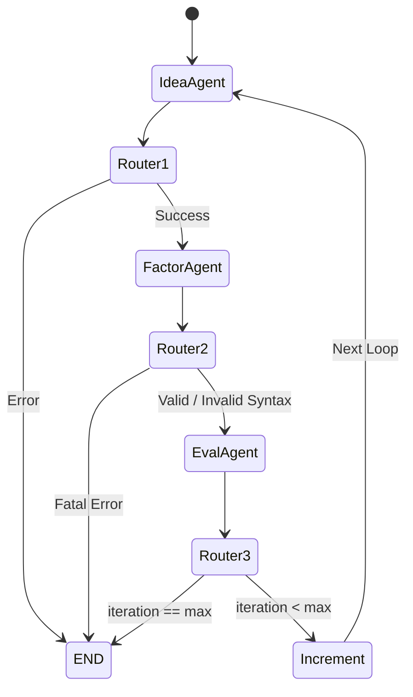

# 🚀 AI Alpha Miner: 全栈核心架构与源码级技术实现全手册 (v3.0 终极详尽版)

## 📖 1. 项目概述与宏观愿景 (Project Overview)

**AI Alpha Miner Swarm** 是一个基于大语言模型（LLM）高级推理能力驱动的端到端自动化量化因子发现系统。本项目摒弃了传统的单线程线性搜索，全面重构为 **主从架构 (Master-Slave Swarm)**。

通过该架构，系统模拟了一个由多名具备不同专业背景的“虚拟量化研究员”（Sub-Agents）组成的顶级量化基金团队。在“基金经理”（Manager）的统筹下，系统实现了：
**“专业化角色分工 -> 深度 RAG 检索 -> 因子假说生成 -> 数学形式化与代码翻译 -> 沙箱矩阵回测 -> 结果汇总筛选 -> 收益率相关性剔除（正交化 Alpha 池）”** 的全生命周期自动化。

---

## 🛠️ 2. 全局技术栈 (Technology Stack)

### 2.1 核心编排与代理层
*   **LangGraph**: 用于构建带有状态记忆的循环有向无环图（Cyclic DAG），实现 Agent 的迭代流转。
*   **LangChain**: 提供大模型底层的 Prompt 模板管理、工具链封装和输出解析。
*   **Pydantic (v2)**: 强制校验 LLM 输出的 JSON 格式，确保非结构化自然语言向结构化数据的稳定转化。

### 2.2 知识库与检索增强 (RAG)
*   **ChromaDB**: 本地持久化的轻量级向量数据库，用于存储研究文献（Knowledge Base）和历史回测记录（Experiences）。
*   **Sentence-Transformers**: 本地 Embedding 模型支持（如 `Qwen-Embedding`, `bge-large`）。
*   **OpenAIEmbeddingFunction**: 统一封装适配 Kimi、智谱 GLM、阿里 Qwen 等云端 Embedding API。

### 2.3 量化引擎与数据科学层
*   **RiceQuant (`rqdatac`)**: 针对 A 股的专业量化数据接口，提供高质量的日线/高频行情及基础财务数据。
*   **Qlib (Microsoft)**: 兼容支持微软的 AI 量化投资平台数据格式和算子语法 (Alpha158)。
*   **Pandas & NumPy**: 构建底层的高性能矩阵计算沙箱（Matrix Computation Sandbox），实现因子的全切面和时间序列向量化计算。
*   **Python `ast` 模块**: 抽象语法树（Abstract Syntax Tree）解析与安全转换，拦截 LLM 幻觉产生的未定义变量，保障 `eval()` 执行的安全性。

### 2.4 并发与调度层
*   **`concurrent.futures.ThreadPoolExecutor`**: 实现 Master 对多个 Slave Agent 的多线程并发调度，大幅缩短整体挖掘时间。

---

## 🗂️ 3. 全局项目结构与职责 (Project Structure)

```text
/home/wh/Documents/aiminer/
├── manager.py             # 【最高统帅】接收命令行参数，分发并发任务，执行最终的 Alpha 正交化去重。
├── sub_agent.py           # 【打工人封装】单人研究员类，封装其专属的 LangGraph 实例，隔离状态污染。
├── main.py                # (遗留/后备) 传统单 Agent 模式入口。
├── workflow/
│   ├── graph.py           # 【神经中枢】定义 LangGraph 状态机的节点 (Nodes) 与有向路由边 (Edges)。
│   └── state.py           # 【全局血液】定义 AlphaMinerState 字典结构，在所有 Agent 间流转。
├── agents/
│   ├── idea_agent.py      # 【大脑】检索 RAG + 宏观行情，结合角色设定，输出因子假说 (JSON)。
│   ├── factor_agent.py    # 【码农】数学形式化 -> Qlib 语法翻译 -> AST 静态验证 -> 失败自动重试。
│   └── eval_agent.py      # 【质检员】调用回测引擎 -> 提取每日收益率 -> 生成改进建议 -> 写回 RAG。
├── core/
│   ├── llm.py             # 【通信网关】统筹多源 LLM API Key，分发 ChatOpenAI 实例。
│   ├── rag.py             # 【记忆中枢】ChromaDB 的 CRUD 封装，负责文档切分、向量化和语义检索。
│   └── alphaeval/
│       ├── rq_eval.py     # 【沙箱引擎】RiceQuant 矩阵式回测引擎，支持因子安全执行、IC 及净值计算。
│       ├── modeltester.py # 兼容 Qlib 环境的评估引擎适配器。
│       └── combo.py       # 多因子组合权重优化逻辑 (等权/风险平价)。
├── schemas/
│   └── messages.py        # 【通讯协议】各 Agent 输出的 Pydantic 数据模型定义。
└── data/
    ├── chroma_db/         # Chroma 向量数据库的物理存储目录。
    └── rag_docs/          # 供 RAG 离线初始化的 Markdown 文献库 (研报、WorldQuant 101 等)。
```

---

## 🗺️ 4. 全局数据结构 (Global Data Structures)

整个系统的核心血液是贯穿 LangGraph 各个节点的全局状态字典。

### 4.1 `workflow/state.py` -> `AlphaMinerState`
采用 `typing.TypedDict` 定义，确保状态字段的严格约束：

```python
class AlphaMinerState(TypedDict, total=False):
    # --- 核心控制与角色 ---
    iteration: int           # 当前迭代轮数 (e.g., 1, 2, 3)
    max_iterations: int      # 设定的最大迭代轮数 (防死循环)
    role_prompt: str         # [关键] 注入的子 Agent 角色设定 (e.g., "你是高频动量专家")
    evaluation_mode: str     # 评估模式 ("ricequant" 或 "qlib")
    
    # --- 知识与上下文环境 ---
    rag_context: str         # RAG 检索到的学术文献与历史经验合并文本
    market_regime_summary: str # 实时大盘宏观状态 (波动率、偏度、趋势)
    
    # --- IdeaAgent 产出 ---
    hypothesis_name: str     # 因子名称
    hypothesis_description: str # 因子经济学或统计学逻辑描述
    rationale: str           # 生成理由
    
    # --- FactorAgent 产出 ---
    math_formula: str        # 严格的数学公式表达
    variables_defined: Dict[str, str] # 变量解释字典
    code_expression: str     # 可执行的 Python/Qlib 代码字符串
    is_valid_syntax: bool    # 静态语法校验是否通过
    
    # --- EvalAgent 产出 ---
    backtest_metrics: Dict[str, float] # 评估指标字典 (IC, Rank IC, Sharpe)
    daily_returns: Dict[str, float]    # [关键] 因子逐日组合收益序列，格式 {"YYYY-MM-DD": 0.05}，用于正交化
    is_effective: bool       # LLM 判定的策略是否有效
    suggested_improvements: str # Review 节点给出的改进建议 (传给下一轮 IdeaAgent)
    is_simulated: bool       # 是否因底层报错而启用了降级模拟得分
    
    error: Optional[str]     # 节点执行中的系统级报错信息
    messages: Annotated[List[str], operator.add] # 执行日志追加列表
```

---

## 🔍 5. 文件级深度剖析：代码结构、流程图与技术实现

接下来，我们将逐一拆解项目中的所有核心文件。

---

### 5.1 【统帅调度层】 `manager.py`

#### 5.1.1 模块定位
系统的最高决策中心，负责启动、分发任务、并发控制以及最终的 Alpha 因子正交化去重。

#### 5.1.2 核心代码结构与技术实现
*   **类 `PortfolioManager`**:
    *   **属性**: 
        *   `self.roles`: `List[str]`，存放各个子 Agent 的设定提示词。
        *   `self.researchers`: `List[AlphaResearcher]`，实例化的打工人列表。
        *   `self.alpha_pool`: `List[Dict]`，最终筛选出的合格因子库。
    *   **方法 `dispatch_tasks(self)`**:
        *   遍历 `roles`，初始化 `AlphaResearcher`，预注入 `role_prompt`。实现物理与内存层面的任务隔离。
    *   **方法 `run_swarm(self, parallel=False)`**:
        *   **并发技术**: 使用 `concurrent.futures.ThreadPoolExecutor`。将所有子 Agent 的 `.run()` 方法提交到线程池。通过 `as_completed` 收集异步结果。如果不开启 parallel，则使用 `for` 循环串行（防本地大模型显存 OOM）。
    *   **方法 `evaluate_and_combine(self, results_list)`**:
        *   **正交化算法核心 (Orthogonalization Backbone)**:
            1.  **绝对门槛过滤**: 读取结果字典中的 `perf_metric`（如 IC），若小于阈值（默认 `0.01`）或抛出 Error，则丢弃。
            2.  **相关性过滤 (Multicollinearity Cull)**: 
                *   提取新因子的 `daily_returns`，用 `pandas.Series` 包装。
                *   遍历已在 `final_pool` 中的每个老因子，将两条时间序列 `pd.concat([new, old], axis=1, join='inner')` 对齐日期。
                *   调用 `aligned_df.corr()` 计算皮尔逊相关系数。
                *   **规则**: 若相关系数 $> 0.7$，说明新因子与旧因子高度同质化（多重共线性），触发剔除机制，确保最终 Alpha 池的多样性。

#### 5.1.3 流程图 (Manager Flow)
```mermaid
graph TD
    Start((启动 manager.py)) --> Parse[解析 argparse 命令行参数]
    Parse --> InitPM[实例化 PortfolioManager]
    InitPM --> Swarm{是否并发 parallel=True?}
    
    Swarm -- Yes --> ThreadPool[启动 ThreadPoolExecutor]
    Swarm -- No --> Serial[串行 For 循环]
    
    ThreadPool --> RunAgents[并发调用所有 AlphaResearcher.run]
    Serial --> RunAgents
    
    RunAgents --> Collect[收集所有结果 List[Dict]]
    Collect --> EvalCombine[进入 evaluate_and_combine]
    
    EvalCombine --> Filter1{IC > 0.01?}
    Filter1 -- No --> Cull1[丢弃劣质因子]
    Filter1 -- Yes --> Filter2{与已有因子 Corr > 0.7?}
    
    Filter2 -- Yes --> Cull2[丢弃高相关性冗余因子]
    Filter2 -- No --> AddPool[加入 Final Alpha Pool]
    
    AddPool --> Output((打印最终正交因子组合))
```

---

### 5.2 【任务封装层】 `sub_agent.py`

#### 5.2.1 模块定位
将错综复杂的 LangGraph 图谱流转封装为一个无状态、易于调用的黑盒任务（Task Wrapper）。

#### 5.2.2 核心代码结构与技术实现
*   **类 `AlphaResearcher`**:
    *   **方法 `__init__`**:
        *   接收 `role_prompt`。
        *   调用 `workflow.graph.build_workflow(...)` 实例化一个**独占的、隔离的** LangGraph 应用 `self.app`。
    *   **方法 `run(self)`**:
        *   **数据结构构建**: 初始化专属的 `initial_state` (类型吻合 `AlphaMinerState`)。
        *   **图谱驱动**: 使用 `self.app.stream(initial_state)` 步进执行所有节点，捕获最新的 `state_update` 刷新本地状态。
        *   **结果提取**: 运行至 `END` 后，从 `final_state` 中安全提取 `backtest_metrics` (IC 表现) 和 `daily_returns` (逐日收益)。若缺失 `Sharpe`，则用 `information_coefficient` 作为代理 `perf_metric`。
        *   **返回格式**: `Dict` 包含 `role, hypothesis, code, metrics, perf_metric, returns (pd.Series), error`。

---

### 5.3 【编排中枢层】 `workflow/graph.py`

#### 5.3.1 模块定位
定义图结构（Nodes）和路由规则（Edges），控制智能体的生命周期。

#### 5.3.2 核心代码结构与技术实现
*   **节点路由函数 (Router Functions)**:
    *   `route_after_idea(state)`: 若状态中存在 `error` -> 路由到 `END`，否则 -> `factor_agent`。
    *   `route_after_factor(state)`: 若语法验证失败 `not state.get("is_valid_syntax")`，触发告警但依然送入 `eval_agent` 依靠底层引擎兜底或触发模拟降级。
    *   `route_after_eval(state)`: **循环控制核心**。检查 `iteration < max_iterations`，若未达到上限 -> 路由到 `increment` 节点；否则 -> `END`。
*   **状态步进函数**:
    *   `increment_iteration(state)`: 返回 `{"iteration": state["iteration"] + 1, "error": None, "is_valid_syntax": True}`，重置关键临时变量，开启下一次大循环。
*   **图构建器 `build_workflow`**:
    *   实例化单例的 `RAGModule` 和各个 `Agent` 类。
    *   初始化 `StateGraph(AlphaMinerState)`。
    *   使用 `.add_node()` 注册实体，`.add_conditional_edges()` 绑定动态路由边，最终 `.compile()` 返回图应用。

#### 5.3.3 流程图 (LangGraph Sub-Workflow)


---

### 5.4 【执行大脑层】 `agents/idea_agent.py`

#### 5.4.1 模块定位
灵感发动机。基于 RAG 知识、宏观环境和分配到的 Role 生成因子假设。

#### 5.4.2 代码结构与技术实现
*   **类 `IdeaAgent`**:
    *   **核心实现 `__call__(self, state)`**:
        1.  **上下文装配 (Context Gathering)**:
            *   调用 `rag.retrieve("Generate a novel quantitative trading alpha...")` 获取 WorldQuant 101 公式和历史经验。
            *   若环境为 RiceQuant，通过反射调用 `rq_eval.RiceQuantEval().get_market_regime()` 动态抓取回测期的市场画像（牛熊趋势、波动率 Ann. Vol、偏度 Skew 等）。
        2.  **角色注入与 Prompt 工程 (Role Injection)**:
            *   从 `state` 抓取 `role_prompt`，将其置于 System Message **最顶层**。
            *   若这是第 2+ 次迭代，则将上一轮 EvalAgent 输出的 `suggested_improvements`（如：“之前过度拟合，建议加入 Rank 去极值”）无缝拼接到 System Message 的末尾。
        3.  **大模型推理**:
            *   通过 `impl_chain.invoke()` 请求大模型。
            *   调用 `_strip_markdown_json` 清洗大模型输出的 Markdown 代码块残留（如 ` ```json ... ``` `）。
            *   使用 Pydantic 的 `HypothesisOutput.model_validate_json()` 强制验证并解析。
        4.  **状态更新**: 返回包含 `hypothesis_name` 等字段的局部字典，交由 LangGraph 合并。

---

### 5.5 【执行编码层】 `agents/factor_agent.py`

#### 5.5.1 模块定位
将文字版的投资逻辑严谨地转化为符合底层量化引擎沙箱规则的 Python/Qlib 代码。

#### 5.5.2 代码结构与技术实现
*   **常量白名单**:
    *   `QLIB_OPERATORS`: 支持的算子集合 (如 `Rank`, `EMA`, `Corr`, `Delta`)。
    *   `QLIB_FIELDS`: 支持的数据字段 (如 `$close`, `$volume`)。
*   **静态方法 `_validate_qlib_expression`**:
    *   基于字符串特征的基础 AST 预检。检查括号 `()` 是否成对闭合、是否包含了 `$xxx` 字段等，防止低级语法错误浪费回测算力。
*   **核心实现 `__call__(self, state)`**:
    *   **步骤一：数学形式化 (Formalization)**
        *   Prompt 诱导 LLM 先将自然语言转化为严谨的数学代数公式，并解释所有变量（填充 `FormalizationOutput`）。这一步是**思维链 (Chain-of-Thought)** 的体现，极大提高了后续代码生成的准确率。
    *   **步骤二：代码翻译与自愈重试环 (Self-Correction Loop)**
        *   将 `QLIB_OPERATORS` 白名单强行写入 Prompt。
        *   开启 `while current_retry <= max_retries:` 的重试环。
        *   LLM 输出 JSON -> 反序列化得 `code_expression` -> 送入静态验证。
        *   若验证失败，则将**“带有错误信息的用户反馈”**追加到消息历史 (`messages.append`) 中，迫使 LLM 原地修复自己的语法错误。重试成功则跳出循环。

#### 5.5.3 流程图 (Factor Generation & Correction)
```mermaid
graph TD
    Start[获取 Hypothesis] --> Math[LLM: 转化为严谨数学公式]
    Math --> BuildPrompt[拼接白名单算子构建 Code Prompt]
    
    subgraph Self-Correction Loop (Max 2 Retries)
        BuildPrompt --> GenCode[LLM: 生成 JSON 代码表达式]
        GenCode --> Check{_validate_qlib_expression 校验}
        
        Check -- Fail --> Feedback[生成纠错反馈消息追加至 Context]
        Feedback --> IncrementRetry[重试次数+1]
        IncrementRetry --> GenCode
        
        Check -- Success --> Valid[跳出循环]
    end
    
    Valid --> Output[更新 State: code_expression]
```

---

### 5.6 【质检与反思层】 `agents/eval_agent.py`

#### 5.6.1 模块定位
调度底层量化沙箱回测代码，计算绩效，提取收益率序列，并由 LLM 对结果进行“主观反思”。

#### 5.6.2 代码结构与技术实现
*   **方法 `_execute_alphaeval_backtest(self, code, mode)`**:
    *   根据模式实例化底层引（如 `RiceQuantEval`）。
    *   调用 `evaluator.run()`。
    *   **关键数据提取**: 抓取 `evaluator.ic`, `evaluator.rankic`，以及至关重要的 **`getattr(evaluator, 'daily_returns', {})`**。
    *   **降级容灾设计**: 若代码过于离谱导致引擎抛出无法恢复的 Exception，进入 `except` 块。使用代码表达式的 MD5 哈希作为随机种子（保证同一代码模拟结果一致），生成模拟的伪随机 IC 表现和**空字典** `{}` 作为 `daily_returns`，标记 `_simulated=True`。防止整个 Pipeline 崩溃。
*   **核心实现 `__call__(self, state)`**:
    *   执行回测拿到 `metrics` 和 `daily_returns`。
    *   **反思网络 (Reflexive Review Module)**:
        *   拼接 `Hypothesis` + `Code` + `Metrics` 给 LLM（充当总监角色）。
        *   LLM 解析各项指标，判定是否有效 (`is_effective`)，并生成实质性的改进建议 (`suggested_improvements`)。
    *   **经验持久化**:
        *   调用 `self.rag.add_experience(...)` 将这段完整的试错经历以长文本格式存入 ChromaDB 向量库，作为后续迭代的长期记忆（Long-term Memory）。

---

### 5.7 【底层支持层一】 `core/rag.py` (检索增强网络)

#### 5.7.1 模块定位
负责与 ChromaDB 交互，实现文档切分、向量化和多路并发检索。

#### 5.7.2 代码结构与技术实现
*   **类 `RAGModule`**:
    *   **动态 Embedding 挂载 (`__init__`)**:
        *   识别 `embedding_provider` 参数。若指定 `local`，加载 HuggingFace 的 `SentenceTransformerEmbeddingFunction` (默认 `Qwen3-Embedding-4B`)；若指定 `glm`/`kimi`，则组装并加载对应云端厂商的 `OpenAIEmbeddingFunction`。
    *   **初始化知识库 (`_init_knowledge_base`)**:
        *   遍历 `data/rag_docs/` 下的 `.md` / `.txt` 文献。
        *   使用 `_chunk_text` 按照段落（`\n\n`）和 `chunk_size=1500` 进行基础切片。
        *   按 Batch Size 分批插入 ChromaDB 的 `knowledge_base` 集合。
    *   **双路检索 (`retrieve`)**:
        *   分别对 `knowledge_col` 和 `experiences_col` 发起向量距离查询。拼接双路结果返回给上层提示词。
    *   **经验写入 (`add_experience`)**:
        *   将单次挖掘结果整合为扁平化字符串，同时将 `IC` 设为 `Metadata`，方便未来进行条件过滤查询。

---

### 5.8 【底层支持层二】 `core/alphaeval/rq_eval.py` (核心量化矩阵沙箱)

#### 5.8.1 模块定位
基于线上/本地高频数据，解析执行 LLM 生成的抽象因子代码，计算收益率和核心指标。

#### 5.8.2 数据结构定义
*   **`self.raw_data`**: 包含 `open`, `close`, `high`, `low`, `volume` 的 DataFrame。为适配 Qlib 范式，执行 `unstack()`，转换为**宽表矩阵** (Index 为 datetime, Columns 为各个 instrument 标的代码)。
*   **`self.label_data`**: 标签矩阵。定义为标的**次日收益率**: `close.shift(-1) / close - 1`。

#### 5.8.3 技术实现深度解析
*   **1. 抽象语法树安全沙箱 (`SafeEvalTransformer`)**:
    *   继承自 `ast.NodeTransformer`。
    *   在执行 `eval()` 前，遍历 AST 语法树中的所有变量节点 (`ast.Name`)。若变量名不在允许的系统上下文环境白名单中（例如 LLM 凭空捏造了 `Sector` 变量），则强制将其修改为**字符串常量** (`ast.Constant(value=node.id)`)，极大程度防范了未捕获异常和潜在的代码注入风险。
*   **2. 矢量化算子映射字典 (`compute_factors`)**:
    *   内部封装了巨量闭包函数，将 Qlib 语法映射到 Pandas 矩阵操作。
    *   例如：`Rank(df)` 映射为 `df.rank(axis=1, pct=True)`（横截面排序）。
    *   例如：`Ref(df, n)` 映射为 `df.shift(_get_n(n))`（时间序列平移）。
    *   将这些映射封装入 `context` 字典，供 `eval()` 取用。
*   **3. 因子评价与收益率计算 (`run`)**:
    *   代码执行后得到全历史的因子值宽表 `factor_df`。
    *   经过横截面 Z-Score 标准化 (`daily_normalize`)。
    *   **逐日组合收益率计算逻辑**:
        *   利用 Pandas `.groupby("datetime")` 逐日遍历。
        *   计算日度多空组合收益：`(因子值 * Label收益率).sum() / 因子绝对值之和`。这一步等价于将 Z-Score 作为配置权重，构建了一个**日度全额换仓的 1 块钱多空杠杆对冲组合**。
        *   结果存入 `self.daily_returns` 字典，供 Manager 进行正交化验证。

#### 5.8.4 流程图 (Matrix Sandbox Engine)
```mermaid
graph TD
    Fetch[通过 rqdatac 拉取 OHLCV] --> Unstack[执行 unstack 转换为 [DateTime x Instrument] 宽表矩阵]
    Unstack --> Prep[构建 Label: 次日涨跌幅]
    
    Code[获取 LLM 生成的因子表达式字符串] --> AST[ast.parse 生成语法树]
    AST --> Transform[SafeEvalTransformer 过滤未知变量]
    Transform --> Compile[compile 为字节码]
    
    Compile --> Eval[eval(code, context) 执行]
    Eval --> ZScore[按行(横截面)进行 Z-Score 标准化]
    
    ZScore --> Merge[与 Label 对齐合并]
    Merge --> CalcIC[按组计算 Correlation (IC / RankIC)]
    Merge --> CalcRet[计算每日组合收益: Sum(W * Ret) / Sum(|W|)]
    
    CalcRet --> Format[转化为 Dict 写入 self.daily_returns]
    Format --> Output((返回至 EvalAgent))
```

---

## 🏁 6. 全手册总结 (Conclusion)

通过本手册的拆解，可以看出 AI Alpha Miner Swarm 是一个极度工程化、高内聚低耦合的分布式 AI 架构：

1.  **顶层 (Manager)**：利用了类似金融机构风险控制的逻辑，严格把控**因子相关性**，确保了 Alpha 的正交与多样化。
2.  **中间层 (Sub-Agent + LangGraph)**：实现了复杂的带记忆自我修正回路，引入了动态角色和 RAG 提示词工程。
3.  **底层 (RQ_Eval + AST Sandbox)**：展示了如何巧妙地利用 Pandas 宽表矩阵和 Python 元编程特性，为大语言模型构建一个安全、高效的量化执行环境。

*This document serves as the absolute technical ground truth for the AI Alpha Miner Swarm project v3.0.*