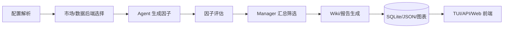
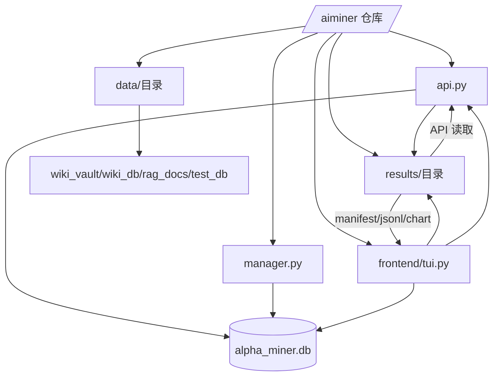
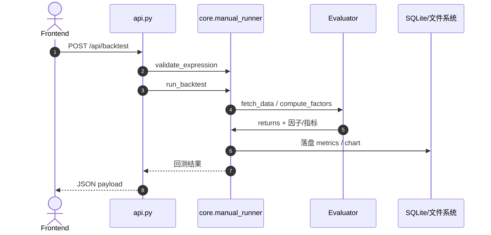
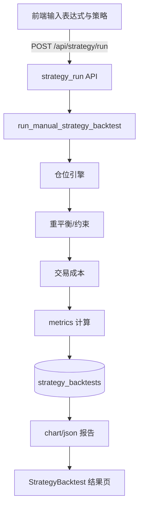
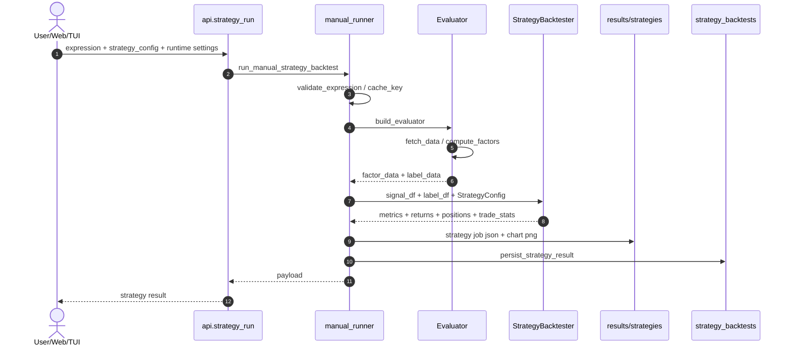
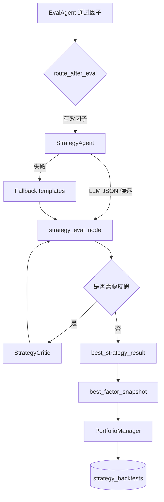
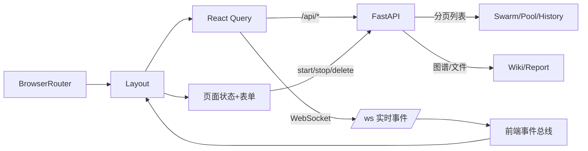
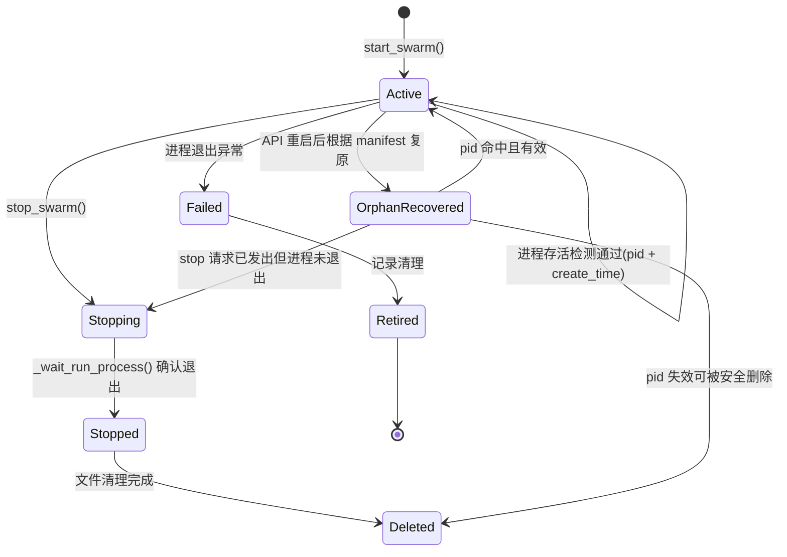
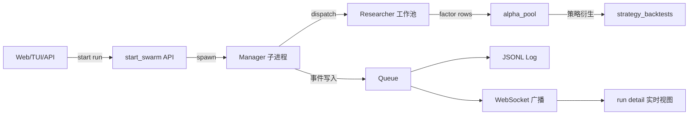
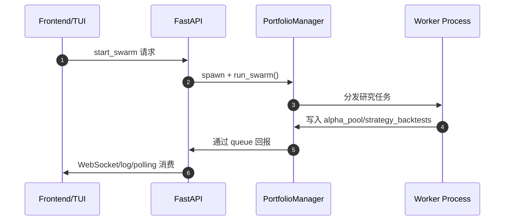

# AI Alpha Miner 全量实现说明

本文档按当前仓库代码重写，目标不是做产品宣传，而是给维护者提供一份可以对照源码逐项核查的技术说明。覆盖范围包括：

- 根目录入口与部署文件
- Python 后端、调度器、Agent、核心评估与 Wiki 模块
- Web 前端、构建链、页面组件、接口契约
- 测试文件与其验证目标
- 运行期产物目录与数据目录

文档约定：

- “文件说明”描述该文件的职责、输入输出和依赖位置
- “函数/类”按源码中的顶层定义逐个列出
- “关键实现块”强调真正影响行为的代码段，而不是把每一行重复成自然语言
- 如果文档和代码不一致，以代码为准，并应优先修正文档

## 1. 当前仓库定位

AI Alpha Miner 是一个围绕量化因子研究构建的多 Agent 系统。它的核心不是单一的 Web 页面，而是一组相互配合的运行面：

- `manager.py` 负责 Swarm 调度、结果筛选、持久化
- `main.py` 负责单 Agent 工作流
- `api.py` 提供 HTTP API、WebSocket 事件流、前端托管
- `tui.py` 提供 Textual 终端工作台
- `frontend/` 提供 React Web 工作台

当前仓库的主执行链可概括为：

```text
配置解析
-> 市场/数据后端选择
-> Agent 生成因子
-> 评估器回测
-> Manager 汇总筛选
-> Wiki / 报告 / SQLite / JSON 持久化
-> TUI / API / Web 前端消费结果
```



## 2. 目录级总览

### 2.1 根目录关键文件

- `README.md`
  作用：仓库对外说明，强调多 Agent Swarm 目标与基本启动方式。
- `instruction.md`
  作用：本技术说明，覆盖实现细节。
- `Dockerfile`
  作用：后端镜像构建文件，当前同时构建 Python 服务与前端静态资源，并把前端产物复制到 `/app/frontend_dist`。
- `docker-compose.yml`
  作用：本地容器编排，当前以 API 服务为主入口。
- `.gitignore`
  作用：忽略 Python 缓存、前端构建产物、运行期 Wiki/结果数据、前端 `node_modules`、TypeScript 构建缓存等。
- `.dockerignore`
  作用：减少 Docker build context，避免把前端依赖和构建产物打包进上下文。
- `.github/workflows/ci.yml`
  作用：CI 流水线，负责最基本的静态校验和测试。
- `environment.yml`
  作用：Conda 环境定义。
- `requirements.txt`
  作用：Python 依赖列表。
- `README_DOCKER.md`
  作用：容器运行说明。
- `CLAUDE.md`
  作用：辅助开发说明，非运行时代码。
- `docs/notes/rd_agent_gap.md`
  作用：RD-Agent 对比补充文档，非运行主链。

### 2.2 Python 源码目录

- `agents/`
  负责 LLM 驱动的假说、因子、评估和汇总 Agent。
- `core/`
  负责配置、评估引擎、RAG、Wiki、本地数据、策略回测等核心能力。
- `app_workflow/`
  负责 LangGraph 状态图与路由逻辑。
- `schemas/`
  负责结构化消息模型。
- `scripts/`
  负责外部知识与数据抓取脚本。

### 2.3 前端目录

- `frontend/`
  React + Vite + TypeScript Web 工作台。

### 2.4 测试目录

- `scripts/manual_tests/`
  以历史实验测试和快速脚本为主，不参与默认 pytest 收集。
- `tests/`
  规范化的单元测试与集成测试。

### 2.5 数据与产物目录

- `results/`
  运行结果，含 `alpha_miner.db`、图表、报告、Swarm run manifest/log。
- `data/wiki_vault/`
  Markdown Wiki 知识库。
- `data/wiki_db/`
  向量数据库。
- `data/rag_docs/`
  RAG 原始资料与模板。
- `data/test_db/`
  测试向量数据库。



## 3. 运行模式与主数据流

### 3.1 Swarm 主流程

```text
Web/TUI/API 发起运行
-> PortfolioManager.dispatch_tasks()
-> AlphaResearcher.run() 并发/串行执行
-> evaluator.run() / strategy.run()
-> PortfolioManager.evaluate_and_combine()
-> SummaryAgent.generate_markdown_report()
-> SQLite + JSON + 图表 + Wiki 更新
```

### 3.2 手工回测流程

```text
前端 / API 提交 expression
-> core.manual_runner.validate_expression()
-> build_evaluator()
-> evaluator.fetch_data() / compute_factors()
-> 指标汇总与曲线落盘
-> API 返回结构化 payload
```



### 3.3 策略回测流程

```text
前端 / API 提交 expression + strategy_config
-> run_manual_strategy_backtest()
-> StrategyBacktester.run()
-> 按横截面/时序模式生成仓位
-> 重平衡、仓位约束、交易成本
-> 输出 metrics / returns / 持久化
```



#### 3.3.1 策略输入契约

策略链路的最小输入由两部分组成：

- `expression`
  因子表达式。它不是直接下单逻辑，而是先通过 evaluator 计算成一个二维信号面板。
- `strategy_config`
  交易规则配置。它描述如何把信号转成仓位、多久调仓、最多持多少标的、成本如何扣除。

完整运行还会携带一组运行上下文：

- `data_backend`
  可为 `ricequant`、`qlib`、`local`，决定 evaluator 从哪里取行情和收益标签。
- `market_profile`、`market_mode`、`market_profiles`
  决定市场配置和单市场/多市场执行方式。
- `local_data_path`、`local_data_layout`
  当使用本地数据时，指定 panel 或 instrument files 的读取语义。
- `run_id`、`source_factor_id`、`agent_id`、`candidate_rank`、`template_name`
  Swarm 场景下的来源追踪字段，用来把策略结果回挂到具体 run、因子和候选策略。
- `signal_multiplier`
  用来支持负 IC 因子的反向交易。负 IC 因子在 Manager 层会设置为 `-1`，策略回测前会把信号整体反号。

#### 3.3.2 `StrategyConfig` 的语义

`StrategyConfig` 是策略层的核心数据结构，定义在 `core/strategy.py`。它不是任意 JSON，而是有语义校验的 Pydantic 模型。

主要字段：

- `strategy_mode`
  `cross_sectional` 表示横截面策略；`time_series` 表示时序策略。
- `signal_source`
  当前主要使用 `expression`，表示信号来自单个因子表达式；预留 `factor_combo` 给组合因子。
- `direction`
  `long_only` 只做多；`long_short` 多空；`long_flat` 只在时序策略里表示多头/空仓切换。
- `selection_rule`
  `top_n`、`bottom_n`、`top_bottom_n`、`threshold`。
- `rebalance_freq`
  `daily`、`weekly`、`monthly`。
- `top_n`、`bottom_n`
  横截面排序策略的多头/空头数量。
- `long_threshold`、`short_threshold`、`exit_threshold`
  阈值策略的入场、反向或退出条件。
- `max_positions`
  最大持仓数量。
- `max_weight_per_position`
  单个标的最大权重。
- `min_holding_days`
  最短持有天数，防止刚开仓就被下一天信号立即换掉。
- `commission_bps`、`slippage_bps`
  手续费和滑点，按换手扣除。
- `market`、`start_date`、`end_date`、`engine`
  回测市场、区间和计算引擎。

语义校验规则：

- `top_n` 策略必须提供 `top_n`。
- `bottom_n` 策略必须提供 `bottom_n`。
- `top_bottom_n` 必须同时提供 `top_n` 和 `bottom_n`。
- `threshold` 至少需要 `long_threshold` 或 `short_threshold`。
- 横截面策略不支持 `long_flat`。
- 时序策略只支持 `threshold`，不支持 `top_n`、`bottom_n`、`top_bottom_n`。

#### 3.3.3 内置策略模板

`strategy_templates()` 提供一组默认模板，供 Web/TUI 一键加载，也供 Agent 失败时回退：

- `cs_top_bottom`
  横截面 Top/Bottom 多空。每天选信号最高的一组做多，最低的一组做空。
- `cs_top_only`
  横截面 Top-N 多头。适合只想表达强信号多头暴露的因子。
- `cs_threshold`
  横截面阈值多头。适合已经归一化到固定范围的信号。
- `ts_long_flat`
  时序阈值多头/空仓。适合趋势型或择时型信号。
- `ts_long_short`
  时序阈值多空。适合同一标的上同时表达上涨与下跌方向的信号。

模板只是起点，不是最终策略。Agent 或用户可以修改阈值、持仓数、调仓频率、成本模型和持有期约束。

#### 3.3.4 手工策略回测链路

手工策略回测由 Web/TUI/API 触发，主路径如下：

```text
POST /api/strategy/run
-> api.strategy_run()
-> core.manual_runner.run_manual_strategy_backtest()
-> validate_expression()
-> build_evaluator()
-> evaluator.fetch_data()
-> evaluator.compute_factors()
-> signal_df / label_df
-> StrategyBacktester.run()
-> save_equity_curve() / save_turnover_curve()
-> persist_strategy_cache()
-> persist_strategy_job()
-> persist_strategy_result()
-> JSON payload 返回前端
```



这一层有两类持久化：

- `strategy_cache_*`
  用于缓存相同表达式、策略配置、数据后端、市场配置、本地数据布局和 `signal_multiplier` 下的结果。
- `strategy_*`
  用户或 Swarm 可见的策略结果 ID。手工策略只按 cache scope 生成；Swarm 策略会额外加入 run/factor/candidate 信息，避免跨 run 覆盖。

#### 3.3.5 信号面板到持仓面板

策略回测的计算核心不是直接执行表达式，而是先把表达式转换为信号面板：

```text
evaluator.factor_data.iloc[:, 0]
-> unstack()
-> signal_df: index=date, columns=instrument, values=factor signal

evaluator.label_data["label"]
-> unstack()
-> label_df: index=date, columns=instrument, values=forward return
```

然后 `StrategyBacktester` 按策略模式生成目标持仓。

横截面策略：

- 每个交易日独立看一行信号。
- `top_n` 选信号最高的 `N` 个标的。
- `bottom_n` 选信号最低的 `N` 个标的。
- `top_bottom_n` 同时做多最高组、做空最低组。
- `threshold` 按横截面信号值是否超过阈值开仓。
- `long_only` 会把负仓位裁掉。

时序策略：

- 每个标的单独看自己的信号时间序列。
- `long_flat` 在超过 `long_threshold` 时做多，低于退出条件时空仓。
- `long_short` 在超过 `long_threshold` 时做多，低于 `short_threshold` 时做空。
- `exit_threshold` 用于从已有仓位退出，避免阈值附近过度来回切换。

目标持仓生成后，还会经过约束层：

- `_rebalance_mask()`
  根据 `daily/weekly/monthly` 判断哪些日期允许重新调仓。
- `max_positions`
  限制非零仓位数量。
- `min_holding_days`
  未达到最短持有期时，保留上一期仓位。
- `_normalize_positions()`
  按 gross exposure 标准化，并裁剪到 `max_weight_per_position`。

#### 3.3.6 收益、成本和指标

策略收益计算逻辑：

```text
gross_returns = sum(positions * label_df, axis=1)
turnover = positions.diff().abs().sum(axis=1)
cost_rate = (commission_bps + slippage_bps) / 10000
costs = turnover * cost_rate
net_returns = gross_returns - costs
```

输出指标包括：

- `annualized_return`
  净值曲线年化后的收益。
- `sharpe`
  日收益均值/波动率乘以 `sqrt(252)`。
- `max_drawdown`
  净值曲线最大回撤。
- `turnover`
  平均换手。
- `win_rate`
  日收益为正的比例。
- `average_holding_period`
  已平仓仓位的平均持有天数。
- `gross_exposure`
  平均总敞口。
- `net_exposure`
  平均净敞口。
- `cost_drag`
  总交易成本拖累。
- `gross_return`、`net_return`
  区间累计毛收益与净收益。

同时会保存：

- `daily_returns`
  每日净收益，供前端 Sparkline 和策略后去相关使用。
- `positions`
  最近几天的非零持仓快照。
- `trade_stats`
  换手、成本、调仓日数等交易统计。
- `chart_paths`
  equity curve 和 turnover curve 图表路径。

#### 3.3.7 Agent 自动策略链路

Swarm 中策略层有两次机会产生结果：

```text
因子通过 EvalAgent
-> route_after_eval()
-> StrategyAgent 生成候选策略
-> strategy_eval_node 回测候选
-> StrategyCritic 可选反思和再生成候选
-> best_strategy_result 写回 best_factor_snapshot
-> SubAgent 返回 factor + strategy payload
-> PortfolioManager 统一规范化/补跑/持久化
```



`StrategyAgent` 的职责：

- 读取 `market_profile`、角色、因子假说、表达式和因子指标。
- 让 LLM 输出最多 3 个结构化候选。
- 每个候选必须能转换成合法 `StrategyConfig`。
- 如果 LLM 失败，使用模板回退。

`strategy_eval_node` 的职责：

- 重新构造 `signal_df` 和 `label_df`。
- 对每个候选运行 `StrategyBacktester`。
- 计算 `selection_score`。
- 选择 `best_strategy_result`。
- 把结果合并到当前最佳因子快照。
- 策略阶段失败只写 `strategy_failure_reason`，不会把已通过的因子判为 fatal error。

`StrategyCritic` 的职责：

- 读取当前最佳策略的指标、分年/分季表现和最差月份。
- 判断是否还值得继续优化。
- 最多提出少量新的策略配置候选。
- 只调整策略层字段，不改因子表达式。

#### 3.3.8 Manager 层的策略归一化与组合筛选

`PortfolioManager` 会在 Swarm 汇总阶段处理策略结果：

- 如果 SubAgent 已返回 `strategy_results`，Manager 会复算 `selection_score` 并规范化字段。
- 如果 SubAgent 只返回 `strategy_candidates`，Manager 会调用 `run_manual_strategy_backtest()` 补跑策略。
- 如果两者都没有，Manager 按市场和 execution style 使用 fallback template。
- 负 IC 因子会通过 `signal_multiplier=-1` 反向信号。
- 每个策略都会生成 run-scoped `strategy_id`，避免同一表达式/配置在不同 run 中覆盖历史。
- 每个因子内部选择 `selection_score` 最高的策略作为 `best_strategy_result`。
- Manager 再按策略收益做一次去相关，避免多个因子虽然表达式不同但策略收益高度重复。

`selection_score()` 的当前权重：

```text
score =
  0.35 * annualized_return
+ 0.35 * sharpe
+ 0.15 * factor_ic
- 0.08 * abs(max_drawdown)
- 0.04 * turnover
- 0.03 * cost_drag
```

如果启用了 walk-forward 且窗口数不少于 2，会削弱样本内 Sharpe 权重，并加入：

- `min_sharpe`
  最差窗口 Sharpe。
- `consistency`
  正 Sharpe 窗口占比。
- `sharpe_std`
  各窗口 Sharpe 波动。

这能降低“只在单一幸运区间有效”的策略得分。

#### 3.3.9 数据库和前端展示

策略结果统一进入 `strategy_backtests` 表，主要字段包括：

- `strategy_id`
  前端和 API 使用的策略主键。
- `cache_key`
  相同表达式+配置+市场上下文的缓存键。
- `run_id`
  来源 Swarm run。
- `source_factor_id`
  策略来自哪个因子。
- `agent_id`
  生成因子的 Agent。
- `candidate_rank`
  原始候选排名。
- `template_name`
  模板或 LLM 候选名。
- `rationale`
  Agent 对策略的理由说明。
- `selection_score`
  Manager/Graph 选择策略时使用的综合分。
- `is_primary`
  是否为该因子的最佳策略。
- `metrics_json`
  策略指标。
- `daily_returns_json`
  策略每日收益。
- `positions_json`
  持仓快照。
- `chart_paths_json`
  图表路径。

前端展示路径：

```text
StrategyBacktestPage
-> api.runStrategy()
-> /api/strategy/run
-> 即时显示 metrics + Sparkline

StrategyBacktestPage
-> api.strategyHistory()
-> /api/strategy/history
-> 历史列表

StrategyBacktestPage
-> api.getStrategy()
-> /api/strategies/{strategy_id}
-> 详情 JSON / 图表 / 删除

AlphaPoolPage
-> 读取因子的 best_strategy
-> Seed to Strategy / Use Strategy
-> 回填 expression + strategy_config
```

维护策略字段时必须同步四处：

- `core/strategy.py`
  `StrategyConfig`、`StrategyBacktester`、`persist_strategy_result`。
- `core/manual_runner.py`
  cache key、payload 物化、图表和策略 job 持久化。
- `api.py`
  请求模型、详情序列化、列表字段。
- `frontend/src/pages/StrategyBacktestPage.tsx`
  默认配置、表单字段、JSON 编辑器、结果展示。

### 3.4 Wiki 图谱流程

```text
LLMWiki.list_pages() / get_page()
-> api._load_wiki_pages()
-> api._build_wiki_graph()
-> /api/wiki/index 与 /api/wiki/graph
-> WikiPage 使用 ForceGraph2D 渲染 Obsidian 风格关系图
```

```mermaid
flowchart LR
  VA[wiki_vault/*.md]
  VA --> PL[api._load_wiki_pages]
  PL --> BG[api._build_wiki_graph]
  BG --> IDX[/api/wiki/index]
  BG --> GR[ /api/wiki/graph ]
  IDX --> WD[Wiki 页面渲染]
  GR --> WD
  WD --> FG[ForceGraph2D 展示]
```

### 3.5 Web 前端运行流

```text
BrowserRouter
-> Layout
-> React Query 拉取 /api/*
-> WebSocket 订阅 /ws
-> 页面级状态与表单驱动交互
-> 指标卡片 / 日志 / 图谱 / 回测结果展示
```



### 3.6 Swarm 状态生命周期图







## 4. 根目录文件逐项说明

### 4.1 `Dockerfile`

文件说明：

- 第一阶段用 `node:20-slim` 构建 `frontend/`，生成 `frontend/dist`
- 第二阶段用 Python 运行时安装后端依赖
- 最终把前端产物复制到 `/app/frontend_dist`
- API 进程既提供后端接口，也托管静态前端

关键实现块：

- 前端 builder stage
  目的：让最终镜像不需要携带 Node 构建工具
- 后端 runtime stage
  目的：只保留运行所需依赖
- `frontend_dist` 复制
  目的：让 `api.py` 能直接通过 `FileResponse` 返回 SPA 静态文件

### 4.2 `docker-compose.yml`

文件说明：

- 默认只定义并启动 API 服务
- 研究 worker 和 TUI 分别放在 `research` / `tui` profile 中
- 注入 CORS、端口映射、数据/results/logs 挂载等运行环境
- 当前偏向单服务部署，而不是前后端分离双容器部署

关键实现块：

- `AIMINER_CORS_ORIGINS`
  解决本地开发时 `5173` 前端与 `8000` API 的跨域问题
- API 单容器模式
  使生产环境可直接依赖一个进程入口
- `worker` profile
  使用 `python -m aiminer.manager --iterations ${AIMINER_ITERATIONS:-5}`（容器内 `PYTHONPATH=/app/src`），不配置自动重启，避免有限任务循环写产物
- `tui` profile
  使用 `docker compose --profile tui run --rm tui` 进入交互式 TUI

### 4.3 `.gitignore`

文件说明：

- 屏蔽 Python 缓存、日志、数据库、前端 `node_modules/`、`dist/`、`*.tsbuildinfo`
- 减少无意义文件进入版本控制

### 4.4 `.dockerignore`

文件说明：

- 避免 Docker 把前端依赖和构建缓存打进 context
- 排除 `data/local_futures/`、`data/ml/`、`data/wiki_db/`、`data/wiki_vault/`、`results/`、`logs/`、`models/` 等生成数据目录
- 减少镜像构建时间和传输量

### 4.5 `.github/workflows/ci.yml`

文件说明：

- 负责基础 CI
- 默认后端 job 只执行 hermetic unit 测试
- 外部依赖和原生插件测试拆成手动触发 job
- 目标是阻止明显不可运行的提交进入主线，同时避免 PR 默认依赖 RiceQuant 凭证或 Rust/Polars 本地插件构建

关键实现块：

- Python 安装与测试
- `pytest tests/unit -m "unit and not external and not native" -q`
- 前端依赖安装与 `npm run build`
- 基础静态校验
- `backend-external`
  手动运行 `pytest -m external -q`，用于 RiceQuant/外部依赖测试
- `backend-native`
  手动构建 `polars_plugins` wheel 后运行 `pytest -m native -q`

### 4.5.1 `.github/workflows/packaging.yml`

文件说明：

- 负责跨平台桌面包构建与可选 Release 发布
- `test-gate` 在前端、sidecar、Tauri 构建前运行 hermetic unit
- `build-frontend` 和 `build-backend` 都依赖 `test-gate`

关键实现块：

- `test-gate`
  安装 Python 依赖、执行基础语法检查和 `pytest tests/unit -m "unit and not external and not native" -q`

### 4.5.2 `pytest.ini`

文件说明：

- 只从 `tests/` 收集测试
- 启用 `--strict-markers`
- 声明 `unit`、`integration`、`external`、`native` markers

测试矩阵：

- `unit`
  hermetic 单测，不依赖外部服务、凭证、生成数据目录或本地原生插件
- `integration`
  本地集成测试，不依赖外部服务
- `external`
  RiceQuant、网络、凭证或外部 vendor 依赖测试
- `native`
  需要已构建 Rust/Polars 原生插件的测试

### 4.5.3 `scripts/reset_workspace.py`

文件说明：

- 提供 dry-run 优先的产物清理 CLI
- `--confirm` 才会移动匹配路径
- 目标被移动到 `results/.trash/<timestamp>/`
- `runs` scope 指向真实 Swarm 产物目录 `results/swarm_runs`

### 4.6 `README.md`

文件说明：

- 仓库对外介绍文档
- 强调多 Agent、正交化、RAG、双评估环境

### 4.7 `README_DOCKER.md`

文件说明：

- Docker 运行说明
- 面向容器使用者而不是源码维护者

### 4.8 `environment.yml`

文件说明：

- Conda 环境定义，覆盖数据、模型、评估所需基础依赖

### 4.9 `requirements.txt`

文件说明：

- pip 依赖列表
- 用于 Docker 和非 Conda 安装场景

### 4.10 `CLAUDE.md`

文件说明：

- 协作式开发说明文档
- 不参与生产运行

### 4.11 `docs/notes/rd_agent_gap.md`

文件说明：

- RD-Agent 对比补充文档，不在主流程中引用

## 5. Python 入口文件逐项说明

### 5.1 `api.py`

文件说明：

- FastAPI 应用主文件
- 提供鉴权、分页、审计、Swarm 进程生命周期管理、Wiki 读取、手工回测、策略回测、前端托管
- 当前 Web 前端与 API 服务已经统一到这个入口

顶层常量：

- `SAFE_ID_RE`
  只允许字母、数字、下划线和中横线，避免路径穿越和非法标识符
- `WIKILINK_RE`
  用于提取 `[[slug]]` 风格引用
- `DB_PATH`
  默认 SQLite 数据库路径
- `SWARM_RUN_DIR`
  Swarm manifest 与 JSONL 日志目录
- `FRONTEND_DIST_DIR`
  Web 前端构建产物目录
- `MAX_CONCURRENT_SWARMS`
  并发运行上限，来自环境变量
- `AUTH_DISABLED`
  可通过环境变量关闭鉴权
- `AUTH_TOKEN`
  Bearer Token 值
- `ALLOWED_ORIGINS`
  CORS 白名单
- `HTTP_BEARER`
  FastAPI Bearer 认证解析器

类：

- `RunState`
  作用：保存单个 Swarm 运行的进程、队列、监听线程、配置和状态。
  方法：
  - `__init__`: 注入 run 运行态对象
  - `pid`: 从进程对象提取 PID，给 API 层展示
- `GlobalState`
  作用：保存全局 socket 集合、事件循环、运行中任务表与锁。
  方法：
  - `__init__`: 初始化内存态状态容器
  - `active_run_ids`: 返回当前仍存活的 run id 列表
  - `running_count`: 返回活动 run 数量
  - `active_run_ids` 与 `running_count` 会同时参考 manifest 与进程活跃性，服务重启后仍可排除僵尸 run
- `Actor`
  作用：表示鉴权后的调用方身份
- `SwarmConfig`
  作用：Swarm 启动请求体
- `BacktestRequest`
  作用：手工因子回测请求体
- `StrategyRunRequest`
  作用：策略回测请求体

函数：

- `_ensure_runtime_dirs()`
  创建数据库目录与 Swarm 日志目录，避免首次启动时目录不存在。
- `_safe_segment(value)`
  校验 URL/path 片段是否合法，不合法直接抛 `400`。
- `_now_iso()`
  返回 UTC ISO 时间戳。
- `_json_dumps(payload)`
  统一 JSON 序列化，保留中文。
- `_db_connect()`
  连接 SQLite，设置 `WAL` 和 `Row` factory。
- `_list_limit(value, maximum)`
  统一分页参数裁剪逻辑。
- `_append_jsonl(path, payload)`
  以 JSONL 方式追加事件日志。
- `_load_json(path)`
  安全读取 JSON 文件，失败时回空字典。
- `_load_jsonl_slice(path, offset, limit)`
  按 offset/limit 读取日志分页。
- `_manifest_path(run_id)`
  计算 run manifest 文件路径。
- `_log_path(run_id)`
  计算 run JSONL 日志路径。
- `_count_rows(table, column, value)`
  统计数据库中特定 `run_id` 或字段关联的行数。
- `_factor_summary_for_run(run_id)`
  汇总某次 Swarm 的因子数和策略数。
- `_resolve_active_pid(state, payload)`
  通过 manifest 中的 `process_pid`、`process_create_time` 与 `psutil` 校验进程真实性。
- `_normalized_run_status(run_id, manifest, default_status)`
  结合运行时活跃性统一标准化返回状态。
- `_annotate_run_manifest(manifest, persist=False)`
  给 manifest 补齐 `is_active` 与 `effective_status`，并可选择持久化回写。
- `_collect_active_run_ids()`
  从 manifest 索引与系统进程扫描出当前真实运行集合。
- `_manifest_result_counts(manifest)`
  从 manifest 读取已缓存的计数结果，并对缺省值做标准化。
- `_queue_put(queue, payload, required=False)`
  给队列写入增加满队列降级与必达事件重试，降低 Swarm 日志回传阻塞。
- `_require_actor(credentials, request)`
  鉴权核心逻辑。支持 `Authorization: Bearer` 和 `X-API-Key`，也支持显式关闭鉴权。
- `_audit(actor, action, target, extra)`
  把关键操作写入日志，形成最基本审计轨迹。
- `broadcast(payload)`
  向所有 WebSocket 客户端广播事件。
- `_emit_event(payload)`
  向日志与 socket 同时写事件。
- `_write_run_manifest(run_id, payload)`
  写 Swarm manifest。
- `_load_run_manifest(run_id)`
  读单个 manifest。
- `_list_run_manifests()`
  列举全部 run manifest。
- `_register_run(run_id, run_state)`
  把运行中的 run 加入全局状态。
- `_cleanup_run(run_id, status_value)`
  更新状态并清理内存态。
- `_stop_process_tree(pid)`
  杀掉 run 相关进程树，避免孤儿子进程残留。
- `_listen_run_queue(run_id, queue)`
  从 multiprocessing queue 消费事件，落 JSONL 并广播。
- `_swarm_process_target(config, queue)`
  子进程入口，内部真正构造 `PortfolioManager` 并执行 `run_swarm`。
- `_wait_run_process(run_id, process)`
  监控子进程退出并回收状态。
- `_paginate_rows(rows, offset, limit)`
  通用列表分页。
- `_row_to_factor_detail(row)`
  把数据库行转成因子详情 payload。
- `_row_to_strategy_detail(row)`
  把数据库行转成策略详情 payload。
- `_load_wiki_pages()`
  扫描 Wiki 文件并抽取 frontmatter。
- `_build_wiki_graph(pages)`
  基于 frontmatter 和 `[[wikilink]]` 生成图节点与边。
- `startup_event()`
  启动时创建目录、保存事件循环引用。
- `read_index()`
  根路径健康文本或说明页。
- `health()`
  健康检查接口。
- `get_results()`
  因子列表分页接口。
- `get_factor_detail()`
  单因子详情接口。
- `get_chart()`
  取图表文件。
- `get_report()`
  取 Markdown 报告文件。
- `wiki_index()`
  Wiki 页面索引分页接口。
- `wiki_page()`
  读取单个 Wiki Markdown 内容。
- `wiki_graph()`
  返回图谱节点与边。
- `wiki_lint()`
  执行 Wiki lint。
- `wiki_migrate()`
  触发 Wiki 迁移逻辑。
- `backtest_validate()`
  验证表达式是否合法。
- `backtest_run()`
  运行手工因子回测。
- `backtest_history()`
  返回手工回测历史。
- `backtest_get()`
  返回单个手工回测任务。
- `backtest_delete()`
  删除手工回测记录。
- `strategy_run()`
  执行策略回测。
- `strategy_history()`
  返回策略回测历史。
- `get_strategies()`
  策略结果分页接口。
- `get_strategy()`
  返回单策略详情。
- `delete_strategy()`
  删除策略结果。
- `get_strategy_chart()`
  返回策略图表。
- `swarm_status()`
  返回当前并发运行状态。
- `admin_reset()`
  执行可逆工作区重置，支持作用域筛选与确认签名。
- `list_swarm_runs()`
  返回 Swarm 历史列表。
- `delete_swarm_run()`
  删除单个 Swarm run 文件资源（manifest + log），并校验进程活跃性后再执行。
- `start_swarm()`
  新建 run、启动子进程、注册监听器。
- `get_swarm_run()`
  返回单个 run manifest 与结果摘要。
- `get_swarm_run_logs()`
  返回分页日志。
- `stop_swarm()`
  对运行中的 Swarm 发出停止请求；活跃进程先进入 `stopping`，只在 watcher 确认退出后收口到最终 `stopped`。
- `websocket_endpoint()`
  WebSocket 连接入口，支持 token query 鉴权和 ping。
- `frontend_fallback()`
  兜底返回 SPA `index.html`。

关键实现块：

- 鉴权块
  `_require_actor` 同时支持 Bearer 和 `X-API-Key`，写接口与重操作接口会通过 `Depends` 强制鉴权。
- CORS 块
  `AIMINER_CORS_ORIGINS` 支持环境变量配置，避免写死开发域名。
- 分页块
  `/api/results`、`/api/wiki/index`、`/api/strategies`、`/api/swarm/runs`、`/api/swarm/runs/{run_id}/logs` 都已统一成分页返回结构。
- Swarm 进程块
  API 不在主事件循环里直接跑长任务，而是开 multiprocessing 子进程，再用 queue+线程回传日志。
- Swarm 活跃判定块
  `list/running/status/delete` 场景下不再只依赖内存 run 状态，而是通过 manifest + 进程存活判断，解决 API 重启后 running 统计不准的问题。
- `delete_swarm_run` 安全块
  删除前会先复用活跃判定，避免删除进程仍在跑的任务记录。
- 状态一致性块
  `list_swarm_runs(status=running)` 会回写 `is_active` 并过滤陈旧运行，API 层不再返回“running 但 inactive”的矛盾记录。
- Stop 两阶段状态机块
  `POST /api/swarm/runs/{run_id}/stop` 不再直接写最终 `stopped`；若进程仍活着，会先写 `stopping` 并广播停止中的状态，待 `_wait_run_process` 确认退出后再写 `stopped`。
- WebSocket 实时日志块
  同一份事件既会写 JSONL，也会通过 socket 广播给前端详情页。
- 前端托管块
  当 `frontend_dist` 存在时，`/` 和 catch-all 都会走 SPA 静态入口。

### 5.2 `manager.py`

文件说明：

- Swarm 主调度器
- 负责构造 `AlphaResearcher`、调度并行任务、筛选有效因子、写库、生成策略结果

函数：

- `run_agent_task(kwargs)`
  进程池全局入口。先引入随机抖动，降低同时打开 SQLite 的竞争，再实例化 `AlphaResearcher`。
- `_serialize_returns(returns)`
  把 pandas `Series` 或 dict 变成 JSON-safe `{date: float}`。

类：

- `PortfolioManager`
  作用：整个项目的核心调度对象。
  方法：
  - `__init__(roles=None, **kwargs)`
    构建 settings，准备默认角色、结果池、`run_id`、`SummaryAgent`，并初始化数据库。
  - `_init_db()`
    创建 `alpha_pool` 表、索引、扩展列和策略表，开启 WAL。
  - `_backfill_from_json()`
    为旧数据库回填 `metrics_json`、`returns_json`、`is_effective`、`perf_metric` 等新字段。
  - `dispatch_tasks(log_queue=None)`
    根据 `market_mode`、`roles` 和 `market_profiles` 生成研究员任务参数。
  - `evaluate_and_combine(results_list)`
    对结果做阈值过滤、相关性去重、报告生成和入库。
  - `run_swarm(parallel=False, log_queue=None)`
    运行整个 Swarm。支持串行和并行，并把运行事件写入日志队列。
- `evaluate_strategies()`
  基于结果池衍生策略回测并持久化。
- `evaluate_strategies()`（新版本）
  优先使用 `strategy_results` 或 `strategy_candidates`（来自 Sub Agent），并重算 `selection_score`，再按分数更新
  `alpha_pool`/`strategy_pool` 排序。

关键实现块：

- SQLite WAL 块
  解决 API/TUI 读、Swarm 写的并发锁问题。
- 兼容迁移块
  旧数据库即使缺列，也会通过 `ALTER TABLE` 自愈。
- 任务分发块
  `batch` 模式下每个市场画像会独立生成一组角色任务。
- 正交筛选块
  `evaluate_and_combine` 不只看收益，还要去掉过度同质化因子。
- Swarm 并发块
  `run_swarm(parallel=True)` 会进入并行执行路径，并把日志写到 queue，供 API/TUI 消费。

### 5.3 `main.py`

文件说明：

- 单 Agent 入口
- 用于调试工作流，而不是完整 Swarm 生产调度

函数：

- `setup_logging()`
  配置日志。
- `save_results()`
  保存结果产物。
- `print_summary()`
  输出简明总结。
- `main()`
  CLI 入口，解析参数，驱动单 Agent 流程。

关键实现块：

- 参数解析块
  支持用单次运行快速验证配置
- 单 Agent 工作流块
  便于排查 LangGraph 节点问题，不受 Swarm 并发噪声影响

### 5.4 `sub_agent.py`

文件说明：

- 定义单个研究员 `AlphaResearcher`
- 是 Swarm 内最小研究执行单元

类：

- `AlphaResearcher`
  方法：
  - `__init__`
    组装角色提示词、知识模块、评估器、工作流状态。
  - `run`
    驱动完整研究-生成-评估循环，返回结果字典。

关键实现块：

- 角色驱动块
  不同 `role_prompt` 会影响假说和因子表达式方向
- 迭代循环块
  会根据评估反馈继续优化而不是一次性生成

### 5.5 `tui.py`

文件说明：

- Textual 终端工作台
- 提供因子浏览、策略模板填充、手工回测、Swarm 控制、结果查看

函数：

- `_db_connect()`
  连接 SQLite 并设置 WAL。
- `run_manager_process()`
  子进程运行 Manager，用于 TUI 启动 Swarm。

类：

- `TUIApp`
  方法：
  - `__init__`
    初始化 UI 状态、表单内容和运行句柄。
  - `compose`
    组装 Textual 布局。
  - `action_vim_down/up/left/right`
    Vim 风格光标移动。
  - `_compute_cumulative`
    把收益序列转换为累计曲线。
  - `on_mount`
    启动时加载表格数据。
  - `load_factors`
    从库中加载因子数据到表格。
  - `load_strategies`
    加载策略结果。
  - `on_data_table_row_selected`
    响应表格选中事件。
  - `action_edit_code`
    编辑代码区域。
  - `action_run_backtest`
    从当前因子触发回测。
  - `on_button_pressed`
    统一处理按钮事件。
  - `_open_editor`
    打开编辑器。
  - `_load_strategy_template`
    装载策略模板。
  - `_apply_strategy_config_to_form`
    将策略 JSON 回填到表单 + 同步文本区域，供“一键种子”与编辑复用。
  - `_seed_selected_factor_to_strategy_tab`
    从 Alpha Pool 选中因子读取 `best_strategy` 并一键填入策略配置页。
  - `_strategy_config_from_form`
    从表单生成策略配置。
  - `_parse_profiles`
    解析市场画像列表。
  - `_sync_strategy_json`
    同步 JSON 编辑器内容。
  - `_run_backtester`
    执行手工因子回测。
  - `_run_strategy_backtester`
    执行策略回测。
  - `_start_swarm`
    启动 Swarm 子进程。
  - `_stop_swarm`
    停止 Swarm。
  - `_finish_swarm`
    清理运行完成后的 UI 状态。
  - `action_quit`
    退出应用。
  - `Seed to Strategy` 集成
    因子页可直接跳转到策略页并回填因子表达式 + 最优策略元数据（`template_name`、`source_factor_id`、评分）用于快速继续迭代。

关键实现块：

- UI 表单块
  用于构造回测和策略请求，而不是让用户手写大段 JSON
- Swarm 子进程块
  避免 TUI 主线程被长任务阻塞
- 数据刷新块
  让终端工作台能持续消费数据库最新结果

### 5.6 `scripts/maintenance/ast_dump.py`

文件说明：

- 用于分析项目 AST 结构

函数：

- `parse_file`
  解析单文件 AST。
- `dump_project`
  扫描项目并输出 AST 概览。

### 5.7 `scripts/maintenance/bundle_all.py`

文件说明：

- 辅助打包/汇总文件内容的工具脚本

函数：

- `run_cmd`
  运行外部命令。
- `should_include`
  判断文件是否纳入 bundle。
- `get_bundle_content`
  收集内容。
- `main`
  CLI 入口。

### 5.8 `fix_zscore.py`

文件说明：

- 单用途试验脚本，用于验证 zscore 修复

函数：

- `zscore_test`
  运行局部验证。

## 6. `agents/` 目录逐项说明

### 6.1 `agents/idea_agent.py`

文件说明：

- 负责生成交易假说和研究方向

类：

- `IdeaAgent`
  方法：
  - `__init__`
    绑定 provider/model/base_url
  - `_strip_markdown_json`
    去掉 LLM 可能返回的 Markdown fence
  - `__call__`
    接收上下文并产出结构化假说

关键实现块：

- Markdown 清洗块
  减少 LLM 输出包裹 ```json 的解析失败

### 6.2 `agents/factor_agent.py`

文件说明：

- 负责从假说生成可执行因子表达式

类：

- `FactorAgent`
  方法：
  - `__init__`
    初始化 LLM 客户端
  - `_strip_markdown_json`
    清除 Markdown 包装
  - `_parse_llm_json`
    解析模型返回的 JSON
  - `_escape_control_chars_in_strings`
    修复字符串内控制字符问题
  - `_validate_qlib_expression`
    对因子表达式做基本语法/字段校验
  - `__call__`
    生成正式表达式与实现说明

关键实现块：

- 输出清洗块
  解决 LLM 输出 JSON 不干净的问题
- 表达式校验块
  提前拦截非法字段和明显错误语法

### 6.3 `agents/eval_agent.py`

文件说明：

- 负责驱动评估器，对候选因子执行回测并提取结果

类：

- `EvalAgent`
  方法：
  - `__init__`
    绑定 LLM/评估配置
  - `_strip_markdown_json`
    清洗 JSON fence
  - `_execute_alphaeval_backtest`
    真正调用底层评估逻辑
  - `__call__`
    以 Agent 形式执行评估

### 6.4 `agents/summary_agent.py`

文件说明：

- 负责把优选因子结果整理成最终报告

类：

- `SummaryAgent`
  方法：
  - `__init__`
    初始化 LLM 配置
  - `generate_equity_curve`
    生成权益曲线图
  - `generate_markdown_report`
    生成 Markdown 报告

关键实现块：

- 报告生成块
  为最终入池因子写可读性的分析报告

## 7. `core/` 目录逐项说明

### 7.1 `core/settings.py`

文件说明：

- 全局配置中心
- 统一解析 CLI、环境变量、覆盖项

函数：

- `_normalize_str`
  清洗字符串配置。
- `_coerce_bool`
  把字符串环境变量转布尔。
- `_coerce_list`
  把逗号分隔配置转列表。
- `provider_api_key`
  按 provider 名称解析不同环境变量。
- `detect_llm_provider`
  根据现有环境变量猜测 provider。
- `build_settings`
  合并 overrides 并产出 `AiminerSettings`。

类：

- `AiminerSettings`
  方法：
  - `validate_values`
    校验枚举值、local backend 约束、市场模式约束
  - `db_path`
    计算数据库路径

关键实现块：

- Provider 解析块
  同时兼容 `kimi`、`glm`、`openai`、`claude`、`ollama`、`lmstudio`、`codex` 等。
  `codex` 是显式 provider，不参与自动探测，避免没有 API key 时意外拉起本地 Codex CLI。
- 约束校验块
  在进入运行前阻止不一致配置流入评估器。`embedding_provider="codex"` 会被拒绝，因为 Codex provider 只负责文本生成，不负责向量 embedding。

### 7.2 `core/runtime.py`

文件说明：

- 运行时标识和日志上下文工具

函数：

- `new_run_id`
  生成 Swarm run id。
- `new_agent_id`
  生成子 Agent id。
- `log_context`
  统一构建日志上下文。

### 7.3 `core/evaluator_factory.py`

文件说明：

- 把 settings 映射成具体评估器实例

函数：

- `resolve_data_backend`
  从评估模式和显式配置确定后端。
- `evaluation_config_from_mapping`
  把字典配置映射成标准结构。
- `build_evaluator`
  根据 engine/backend 选择 `RiceQuantEval` 或本地评估器。

类：

- `EvaluationConfig`
  统一评估配置数据模型。

### 7.4 `core/market_profiles.py`

文件说明：

- 市场画像定义

函数：

- `get_market_profile`
  返回指定市场画像。

类：

- `MarketProfile`
  表示单个市场的元数据和约束。

### 7.5 `core/local_data.py`

文件说明：

- 本地行情数据加载器
- 支持自动推断布局

函数：

- `_read_table`
  读取 csv/parquet。
- `_canonicalize_columns`
  统一列名。
- `_ensure_schema`
  约束必须字段。
- `_iter_data_files`
  遍历本地数据文件。
- `infer_layout`
  推断 `panel` 或 `instrument_files`。
- `resolve_local_profile_path`
  计算市场画像对应路径。
- `load_local_ohlcv`
  返回标准 OHLCV 面板数据。

关键实现块：

- 布局推断块
  兼容不同本地数据组织方式
- 列名标准化块
  尽量把异构数据映射到统一评估输入

### 7.6 `core/llm.py`

文件说明：

- LLM 客户端适配层

函数：

- `get_llm_config`
  基于 provider/model/base_url 生成客户端配置。
- `get_llm`
  返回实际 LLM 对象。

关键实现块：

- OpenAI-compatible provider 块
  `kimi`、`qwen`、`glm`、`openai`、`deepseek`、`openrouter`、`groq`、`ollama`、`vllm`、`lmstudio`、`claude` 最终都返回 `ChatOpenAI` 兼容对象。
- Codex provider 块
  当 `llm_provider="codex"` 时，`get_llm()` 返回 `CodexChatModel`，不使用 `llm_base_url`，也不要求 API key。
  默认模型为 `gpt-5.4`，可通过 `--llm-model` 或 API payload 的 `llm_model` 覆盖。
  思考强度可通过 `llm_reasoning_effort` 设置，允许值为 `low`、`medium`、`high`、`xhigh`。
  该 provider 设计成“本地 LLM 替代选项”，不是执行项目改写的 Agent。

### 7.6.1 `core/codex_llm.py`

文件说明：

- 本地 Codex CLI 的 LangChain chat wrapper
- 通过 `codex exec` 把本机 Codex 能力接入现有 Agent 调用链
- 默认使用只读、临时会话，降低 Swarm 调用时误改工作区的风险

函数：

- `codex_command`
  解析 `AIMINER_CODEX_CMD` 或默认 `codex`，并检查可执行文件是否存在。
- `is_codex_available`
  返回本机 Codex CLI 是否可用。

类：

- `CodexChatModel`
  继承 LangChain `BaseChatModel`，实现 `_generate()`。
  会把 LangChain messages 渲染成 prompt，通过 stdin 传给 `codex exec`。
  输出优先读取 `--output-last-message` 文件；如果文件为空，则回退读取 stdout 最后一行。

运行边界：

```text
LangChain Agent
  -> core.llm.get_llm(provider="codex", reasoning_effort="xhigh")
  -> CodexChatModel._generate()
  -> codex exec -c model_reasoning_effort="xhigh" --ephemeral --sandbox read-only --output-last-message <tmp> -m <model> -C <cwd> -
  -> AIMessage(content=<last message>)
```

配置项：

| 配置 | 作用 |
| --- | --- |
| `llm_provider=codex` | 显式启用本地 Codex provider |
| `llm_model=gpt-5.4` | 传给 `codex exec -m` 的模型名 |
| `llm_reasoning_effort=xhigh` | 传给 `codex exec -c model_reasoning_effort="xhigh"` 的思考强度 |
| `AIMINER_CODEX_CMD` | Codex CLI 路径或命令，默认 `codex` |
| `AIMINER_CODEX_TIMEOUT_SECONDS` | 单次 Codex 调用超时，默认 180 秒 |
| `AIMINER_CODEX_REASONING_EFFORT` | Codex 默认思考强度，允许 `low/medium/high/xhigh` |
| `embedding_provider=local` | 推荐与 Codex 搭配使用的 embedding 选项 |

注意事项：

- Codex provider 不会被 `detect_llm_provider()` 自动选中，必须显式配置。
- Codex provider 不支持 embedding，`embedding_provider=codex` 会在 settings/API 边界被拒绝。
- 当前允许并发调用；Swarm 并行时可能同时启动多个 `codex exec` 进程。
- 如果后续发现本地资源争用，应增加 `AIMINER_CODEX_MAX_CONCURRENT` 或改为串行锁。

### 7.7 `core/rag.py`

文件说明：

- 通用 RAG 模块

类：

- `RAGModule`
  方法：
  - `__init__`
    初始化 embedding 与向量库
  - `_chunk_text`
    文本切块
  - `_init_knowledge_base`
    建库或加载已有库
  - `_safe_query`
    安全检索包装
  - `retrieve`
    检索相关上下文
  - `add_experience`
    写入新经验

关键实现块：

- 切块块
  决定向量召回粒度
- 安全查询块
  降低空库或异常检索导致的主流程中断

### 7.8 `core/hybrid_knowledge.py`

文件说明：

- 混合知识层，整合 RAG 与 Wiki

类：

- `HybridKnowledge`
  方法：
  - `__init__`
    初始化 Wiki 与 RAG
  - `bootstrap_wiki`
    从资料初始化 Wiki
  - `retrieve`
    混合召回上下文
  - `query_wiki_pages`
    搜索 Wiki 页面
  - `lint_wiki`
    执行 Wiki lint
  - `update_wiki_after_eval`
    在评估后更新知识库

### 7.9 `core/wiki.py`

文件说明：

- Markdown Wiki 核心实现
- 支持 frontmatter、索引重编译、回链审计、查询、迁移

函数：

- `_parse_frontmatter`
  解析页头元数据。
- `_dump_frontmatter`
  序列化 frontmatter。

类：

- `LLMWiki`
  方法：
  - `__init__`
    绑定 vault 路径和日志位置
  - `list_pages`
    扫描页面元信息
  - `add_or_update_page`
    新增或更新页面
  - `flush`
    刷盘
  - `_derive_summary`
    从内容推导摘要
  - `_log_event`
    写 Wiki 日志
  - `_backlink_audit`
    回链检查
  - `_ensure_file`
    确保页面文件存在
  - `_read_page_meta`
    读取单页元信息
  - `_recompile_index`
    重建索引页
  - `migrate_legacy_pages`
    迁移旧页面格式
  - `lint`
    执行一致性检查
  - `query_pages`
    按关键字查询页面
  - `retrieve`
    读取检索上下文
  - `get_page`
    返回页面完整内容

关键实现块：

- Frontmatter 块
  所有 Wiki 图谱与索引都依赖 frontmatter 中的类型、状态、标签、更新时间
- 回链审计块
  防止页面关系只存在单向文本而没有结构化痕迹
- 索引重编译块
  保持 Wiki 首页和图谱数据一致

### 7.10 `core/wiki_bootstrapper.py`

文件说明：

- 把外部知识文档初始导入 Wiki

类：

- `WikiBootstrapper`
  方法：
  - `__init__`
    初始化输入目录和 Wiki
  - `run`
    执行导入流程
  - `_summarize_to_wiki`
    把原文摘要成 Wiki 页面

### 7.11 `core/template_renderer.py`

文件说明：

- 用于模板枚举和渲染

类：

- `TemplateRenderer`
  方法：
  - `__init__`
    初始化模板目录
  - `list_templates`
    列出可用模板
  - `render`
    渲染指定模板
  - `render_auto`
    自动选择模板

### 7.12 `core/manual_runner.py`

文件说明：

- 手工回测和手工策略回测的统一执行层
- API 和 TUI 都依赖它

函数：

- `job_id_for`
  生成手工任务 id。
- `persist_job`
  持久化普通回测结果。
- `load_job`
  加载普通回测结果。
- `list_jobs`
  列出普通回测历史。
- `persist_strategy_job`
  持久化策略回测结果。
- `load_strategy_job`
  加载策略回测结果。
- `list_strategy_jobs`
  列出策略历史。
- `delete_job`
  删除普通回测。
- `delete_strategy_job`
  删除策略回测。
- `validate_expression`
  检查表达式字段和语法。
- `save_equity_curve`
  生成并保存曲线图。
- `save_turnover_curve`
  保存换手曲线。
- `run_manual_backtest`
  执行手工因子回测。
- `run_manual_strategy_backtest`
  执行手工策略回测。

关键实现块：

- 任务持久化块
  让 API 历史查询不需要重复运行昂贵回测
- 表达式验证块
  在进入评估器前进行早期失败
- 图表保存块
  为 TUI/API/前端都提供可复用图像产物

### 7.13 `core/strategy.py`

文件说明：

- 策略配置、仓位构造、回测结果持久化
- 是“因子”到“可交易策略”的桥接层

函数：

- `strategy_templates`
  返回策略模板集合。
- `_normalize_positions`
  标准化持仓权重。
- `_rebalance_mask`
  生成重平衡掩码。
- `ensure_strategy_table`
  初始化 `strategy_backtests` 表和索引。
- `persist_strategy_result`
  把策略结果写入数据库。

类：

- `StrategyConfig`
  方法：
  - `validate_semantics`
    校验选择规则、阈值、仓位上限、方向等语义约束。
- `StrategyProposalOutput`
  结构化策略方案模型。
- `StrategyBacktestResult`
  方法：
  - `to_payload`
    转换为 API 友好的 dict。
- `StrategyBacktester`
  方法：
  - `__init__`
    绑定表达式、策略配置和评估器
  - `run`
    执行完整策略回测
  - `_build_cross_sectional_positions`
    构造横截面多空持仓
  - `_build_time_series_positions`
    构造时序持仓
  - `_apply_rebalance_and_constraints`
    执行调仓、持仓数、权重上限、持有期等约束

关键实现块：

- 策略表迁移块
  当前已增加 `run_id`、`source_factor_id`、`template_name`、`rationale`，用于把策略结果回挂到 Swarm 与策略来源展示。
- 横截面持仓块
  支持 `top_bottom_n` 等规则。
- 时序持仓块
  用阈值和方向做单标的/逐时序决策。
- 约束块
  把交易成本、最小持有期、仓位数量上限等从“信号”转成“可交易结果”。

### 7.14 `core/local_data.py`

已在上文说明。

### 7.15 `core/manual_runner.py`

已在上文说明。

### 7.16 `core/wiki_bootstrapper.py`

已在上文说明。

### 7.17 `core/wiki.py`

已在上文说明。

### 7.18 `core/alphaeval/modeltester.py`

文件说明：

- 传统评估实现之一
- 提供因子收益、协方差熵、总结指标等能力

函数：

- `zscore`
  标准分数工具。

类：

- `AlphaEval`
  方法：
  - `__init__`
    绑定评估环境
  - `fetch_data`
    获取数据
  - `calculate_pnl`
    计算收益
  - `calculate_covariance_entropy`
    计算协方差熵
  - `LLM_scores`
    汇总供 LLM 使用的分数
  - `run`
    执行回测
  - `summary`
    输出摘要
  - `run_single_factor`
    运行单因子

### 7.19 `core/alphaeval/rq_eval.py`

文件说明：

- RiceQuant 评估器实现
- 当前 Web/TUI 默认使用频率较高的评估后端之一

函数：

- `zscore`
  标准化工具。
- `init_rq_auth`
  初始化 RiceQuant 凭证。

类：

- `SafeEvalTransformer`
  方法：
  - `__init__`
    初始化安全 AST 转换器
  - `visit_Call`
    限制调用节点
  - `visit_Name`
    限制变量名
- `RiceQuantEval`
  方法：
  - `__init__`
    绑定参数与环境
  - `_configure_matplotlib`
    配置绘图
  - `calculate_layered_returns`
    计算分层收益
  - `generate_plots`
    绘制图表
  - `fetch_data`
    拉取数据
  - `_normalize_factors`
    归一化信号
  - `compute_factors`
    用 pandas 计算因子
  - `compute_factors_polars`
    用 polars 计算因子
  - `get_market_regime`
    识别市场状态
  - `run_robustness_test`
    运行稳健性测试
  - `calculate_pnl`
    计算组合收益
  - `run`
    执行完整评估
  - `dry_run`
    轻量验证运行
  - `summary`
    结果摘要

关键实现块：

- 安全表达式块
  `SafeEvalTransformer` 用 AST 控制执行边界，避免表达式变成任意代码执行。
- 双引擎块
  同时支持 pandas 和 polars 计算路径。
- 稳健性块
  不是只看单次 IC，还补充稳健性验证。

### 7.20 `core/alphaeval/polars_engine.py`

文件说明：

- Polars 表达式执行引擎
- 是当前高性能计算路径的核心

函数：

- `get_plugin_path`
  返回 Rust Polars 插件路径。
- `register_ts_rank`
  注册时间序列 rank 插件。
- `register_ts_argmax`
  注册时间序列 argmax 插件。
- `register_ts_argmin`
  注册时间序列 argmin 插件。
- `Rank`, `CSRank`, `CSZScore`
  横截面排序/标准化操作。
- `_get_int`
  抽取窗口参数。
- `Mean`, `Std`, `Median`, `Sum`
  统计滚动操作。
- `Ref`, `Delta`
  时序引用和差分。
- `_ensure_expr`
  把字面值统一为表达式。
- `Abs`, `Log`, `Sign`, `Sqrt`, `Exp`, `Ceil`, `Floor`, `Round`, `Sin`, `Cos`, `Tan`
  数学变换。
- `Not`, `If`, `Greater`, `Less`, `GreaterEqual`, `LessEqual`, `Equal`, `NotEqual`, `And`, `Or`
  逻辑和条件表达式。
- `Corr`, `Cov`, `Var`, `Skew`, `Kurt`, `Mad`
  滚动统计操作。
- `Scale`, `WMA`, `Ts_Rank`, `Ts_Max`, `Ts_Min`, `Ts_ArgMax`, `Ts_ArgMin`, `EMA`, `Winsorize`, `GroupNeutral`, `Percentile`, `Clip`, `Count`, `Ts_Percentile`
  因子 DSL 所需运算集合。
- `_python_compile_alpha`
  把 DSL 转为 Python 可执行形式。
- `_preprocess_expression`
  预处理表达式文本。

类：

- `_ColFallback`
  方法：
  - `__missing__`
    缺失列时的兜底行为。
- `PolarsEngine`
  方法：
  - `__init__`
    初始化 DataFrame、命名空间和插件
  - `evaluate`
    评估单表达式
  - `compute_all`
    批量计算
  - `_eager_eval`
    立即执行路径
  - `_eval_ast_node`
    AST 节点级求值
  - `_is_bare_col`
    判断是否裸列名

关键实现块：

- DSL 运算符集合块
  这个文件决定了表达式语言到底支持什么。
- AST 求值块
  不走 `eval` 裸执行，而是走受控节点解释。
- Rust 插件块
  对 `Ts_Rank`、`Ts_ArgMax`、`Ts_ArgMin` 等高频窗口运算做扩展。

### 7.21 `core/alphaeval/local_eval.py`

文件说明：

- 本地数据回测实现

类：

- `LocalDataEval`
  方法：
  - `__init__`
    绑定本地数据源
  - `_load_profile_frame`
    加载市场画像数据
  - `fetch_data`
    拉取回测数据
  - `get_market_regime`
    识别市场状态

### 7.22 `core/alphaeval/combo.py`

文件说明：

- 组合权重训练模块

类：

- `WeightCalculator`
  方法：
  - `__init__`
    初始化权重器
  - `fetch_data`
    拉取组合训练数据
  - `compute_mean_ic`
    计算平均 IC
  - `train_optimal_weights`
    训练最优权重
  - `fit`
    执行完整拟合

### 7.23 `core/alphaeval/noise_proc.py`

文件说明：

- 噪声注入工具，用于稳健性或对抗测试

类：

- `NoiseInjection`
  方法：
  - `__init__`
  - `__call__`
- `NoiseInjection_t`
  方法：
  - `__init__`
  - `__call__`

### 7.24 `core/alphaeval/__init__.py`

文件说明：

- 包初始化文件

### 7.25 `core/market_profiles.py`

已在上文说明。

## 8. `app_workflow/` 与 `schemas/` 说明

### 8.1 `app_workflow/state.py`

文件说明：

- 定义 LangGraph 工作流状态对象

类：

- `AlphaMinerState`
  作用：承载假说、表达式、评估结果、迭代次数、终止条件等。

### 8.2 `app_workflow/graph.py`

文件说明：

- 定义工作流路由和图结构

函数：

- `route_after_idea`
  假说后跳转。
- `route_after_factor`
  因子生成后跳转。
- `route_after_eval`
  回测后决定继续、进 Wiki 或结束。
- `route_after_wiki`
  Wiki 更新后跳转。
- `increment_iteration`
  迭代计数器推进。
- `build_workflow`
  构建 LangGraph。

关键实现块：

- 早停块
  根据评估结果和耐心值决定是否终止
- 分支路由块
  保证工作流节点只在合法状态迁移

### 8.3 `schemas/messages.py`

文件说明：

- 定义 Agent 之间传递的结构化消息

类：

- `HypothesisOutput`
- `FormalizationOutput`
- `ImplementationOutput`
- `ReflexiveReviewOutput`

这些模型的作用是让 LLM 输出具有稳定字段，而不是依赖自由文本。

## 9. `scripts/` 目录逐项说明

### 9.1 `scripts/download_qlib_data.py`

函数：

- `download_qlib_data`
  下载 Qlib 数据。

### 9.2 `scripts/fetch_academic_papers.py`

函数：

- `fetch_arxiv_papers`
  抓取学术论文。

### 9.3 `scripts/fetch_arxiv_qfin.py`

函数：

- `fetch_arxiv_papers`
  抓取量化金融方向 arXiv 论文。

### 9.4 `scripts/fetch_arxiv_with_pkg.py`

函数：

- `fetch_arxiv_papers`
  用额外包支持的实现方式抓取论文。

### 9.5 `scripts/fetch_macro_news.py`

函数：

- `resolve_market_window`
  确定市场窗口。
- `_strip_html`
  清除 HTML。
- `_build_google_news_url`
  生成 Google News 查询 URL。
- `_fetch_google_news`
  发起抓取。
- `fetch_and_persist_macro_news`
  保存宏观新闻资料。

### 9.6 `scripts/fetch_market_metadata.py`

函数：

- `generate_market_metadata`
  生成市场元信息文档。

## 10. Web 前端实现逐项说明

### 10.1 前端架构概览

前端技术栈：

- React 18
- TypeScript 5
- Vite 5
- React Router 6
- TanStack React Query 5
- React Force Graph 2D
- React Markdown

前端职责：

- 作为 Web 工作台，不承担业务计算
- 所有核心计算仍由 `/api/*` 和后端模块执行
- 前端只负责参数编辑、任务发起、实时日志消费、结果可视化

### 10.2 `frontend/package.json`

文件说明：

- 定义前端依赖和脚本

关键脚本：

- `dev`
  启动 Vite 开发服务器
- `build`
  TypeScript 构建后再执行 `vite build`
- `preview`
  预览构建结果

### 10.3 `frontend/package-lock.json`

文件说明：

- 锁定前端依赖版本

### 10.4 `frontend/tsconfig.json`

文件说明：

- 前端 TypeScript 主配置

### 10.5 `frontend/tsconfig.node.json`

文件说明：

- Vite Node 侧配置文件的 TypeScript 设置

### 10.6 `frontend/vite.config.ts`

文件说明：

- Vite 配置

函数：

- 默认导出 `defineConfig(...)`
  配置 React 插件、开发服务器、API 代理和 WebSocket 代理。

关键实现块：

- `/api` 代理到 `127.0.0.1:8000`
- `/ws` 走 websocket proxy

### 10.7 `frontend/index.html`

文件说明：

- SPA 模板入口，挂载根节点

### 10.8 `frontend/Dockerfile`

文件说明：

- 前端静态站点独立镜像方案
- 当前主部署链虽然已转成 API 单镜像托管，但这个文件保留了纯静态托管选项

### 10.9 `frontend/nginx.conf`

文件说明：

- 静态站点 nginx 配置
- 用于 SPA 回退和 API 反向代理场景

### 10.10 `frontend/src/main.tsx`

文件说明：

- 前端运行时入口

关键实现块：

- 创建 `QueryClient`
- 注入 `QueryClientProvider`
- 注入 `BrowserRouter`
- 挂载 `App`

### 10.11 `frontend/src/App.tsx`

文件说明：

- 顶层路由定义

函数：

- `App()`
  注册以下路由：
  - `/` -> `SwarmRunsPage`
  - `/runs/:runId` -> `SwarmRunDetailPage`
  - `/pool` -> `AlphaPoolPage`
  - `/manual` -> `ManualBacktestPage`
  - `/strategy` -> `StrategyBacktestPage`
  - `/wiki` -> `WikiPage`

### 10.12 `frontend/src/types.ts`

文件说明：

- 前端类型契约

类型：

- `SwarmRunSummary`
  描述 run 概览、状态、配置和结果计数。
- `Paginated<T>`
  与后端分页接口匹配的通用结构。
- `FactorSummary`
  因子池列表项。
- `StrategySummary`
  策略列表项。
- `SwarmRunSummary`
  当前状态字段除 `starting/running/completed/failed/stopped` 外，还需要兼容 `stopping` 这一中间态。
- `WikiGraphNode`
  Wiki 图节点。
- `WikiGraphEdge`
  Wiki 图边，`kind` 区分 `related` 和 `wikilink`。

### 10.13 `frontend/src/lib/api.ts`

文件说明：

- 前端 API 客户端

函数：

- `getStoredToken()`
  从 `localStorage` 读 token。
- `setStoredToken(value)`
  写 token。
- `withBase(path)`
  拼接 `VITE_API_BASE_URL`。
- `request<T>(input, init)`
  统一 fetch 包装，自动附加 `Authorization: Bearer` 与 `X-API-Key`，处理 JSON/文本返回。

对象：

- `api`
  方法：
  - `listRuns`
  - `getRun`
  - `getRunLogs`
  - `startRun`
  - `stopRun`
  - `deleteRun`
  - `adminReset`
  - `swarmStatus`
  - `listFactors`
  - `getFactor`
  - `runBacktest`
  - `deleteBacktest`
  - `validateBacktest`
  - `backtestHistory`
  - `getStrategies`
  - `getStrategy`
  - `runStrategy`
  - `deleteStrategy`
  - `strategyHistory`
  - `wikiLint`
  - `wikiMigrate`
  - `wikiIndex`
  - `wikiPage`
  - `wikiGraph`

关键实现块：

- Token 注入块
  token 保存在 `localStorage`，HTTP 请求同时附带 `Authorization` 和 `X-API-Key`，避免启用鉴权后写操作 401。
- Content-Type 自适应块
  Wiki 页面接口返回文本时不会被强行 JSON 解析

### 10.14 `frontend/src/lib/ws.ts`

文件说明：

- WebSocket Hook

函数：

- `useSocketFeed()`
  建立 `/ws` 连接，附带 token query，自动重连，维护最近 500 条事件。

关键实现块：

- 指数退避重连块
  断开后从 1 秒回退到最多 10 秒
- ping 保活块
  15 秒发送一次 ping，维持连接

### 10.15 `frontend/src/components/Layout.tsx`

文件说明：

- 页面壳层

函数：

- `Layout()`
  提供侧边导航、Token 输入框和 `<Outlet />`。

关键实现块：

- API Token 输入块
  用户输入后即写入 `localStorage`
- 固定导航块
  把主要工作台功能暴露为一组主导航

### 10.16 `frontend/src/components/SectionCard.tsx`

函数：

- `SectionCard({ title, actions, className, children })`
  通用卡片容器组件。

### 10.17 `frontend/src/components/MetricGrid.tsx`

函数：

- `MetricGrid({ metrics })`
  把键值对渲染成指标卡；无数据时显示提示文本。

### 10.18 `frontend/src/components/JsonView.tsx`

函数：

- `JsonView({ value })`
  以格式化 JSON `<pre>` 展示对象。

### 10.19 `frontend/src/components/Sparkline.tsx`

函数：

- `Sparkline({ returns, title })`
  把日收益字典转换成累计收益折线 SVG。

关键实现块：

- 排序块
  先按日期排序，防止 path 顺序错乱
- 累乘块
  使用 `(1+r)` 累乘而不是简单累加
- 归一化绘制块
  将累计值映射到 `viewBox 100x100`

### 10.20 `frontend/src/pages/SwarmRunsPage.tsx`

文件说明：

- Swarm 启动页与运行列表页

函数：

- `SwarmRunsPage()`
  功能：
  - 编辑 Swarm 启动参数
  - 查询当前运行数和并发上限
  - 发起新 run
  - 列出历史 run 并跳详情页
  - 对运行中 run 发 stop 请求，并在列表项上显示 `Stopping...` 的中间态反馈

关键实现块：

- `defaultRoles`
  给用户提供默认角色集合
- `payload` `useMemo`
  把表单字符串统一转换成 API 所需结构
- `startMutation`
  启动成功后失效 `runs` 和 `swarm-status` 查询
- stop 反馈块
  stop 发出后会先在本地标记 stopping，等后端状态真正落成最终态后再切换为删除按钮，避免 `status` / `is_active` 混用导致的按钮错位。

### 10.21 `frontend/src/pages/SwarmRunDetailPage.tsx`

文件说明：

- 单次运行详情页

函数：

- `SwarmRunDetailPage()`
  功能：
  - 获取 run manifest
  - 拉取历史日志
  - 通过 socket 接收实时日志
  - 聚合因子结果和策略结果
  - 提供 stop run 按钮和 `Stopping...` 过程反馈

关键实现块：

- `liveEvents`
  只筛当前 `runId` 的 socket 事件
- `mergedLogs`
  合并实时事件与历史日志，并做去重
- `stopMutation`
  停止运行后刷新列表和详情；若 stop 请求已发出但进程仍活着，详情页会明确展示 `stopping` 而不是误标成最终停止

### 10.22 `frontend/src/pages/AlphaPoolPage.tsx`

文件说明：

- 因子池浏览页

函数：

- `AlphaPoolPage()`
  功能：
  - 拉取因子池列表
  - 支持选中单因子
  - 展示指标、收益曲线和原始详情 JSON

### 10.23 `frontend/src/pages/ManualBacktestPage.tsx`

文件说明：

- 手工因子回测页

函数：

- `ManualBacktestPage()`
  功能：
  - 编辑 expression 和参数
  - 触发表达式验证
  - 触发手工回测
  - 查看历史任务
  - 展示结果曲线和指标

关键实现块：

- `defaultRequest`
  预设回测参数，便于开箱即测
- `validateMutation`
  验证表达式，不直接跑全量回测
- `runMutation`
  真正执行回测并展示结果

### 10.24 `frontend/src/pages/StrategyBacktestPage.tsx`

文件说明：

- 策略回测页

函数：

- `StrategyBacktestPage()`
  功能：
  - 输入因子表达式
  - 在表单模式和高级 JSON 模式之间切换
  - 运行策略回测
  - 展示策略历史与即时结果
  - 读取 AlphaPool 最佳策略种子并支持一键写入策略表达式与配置

关键实现块：

- `advancedMode`
  允许高级用户直接编辑 JSON
- `strategyConfig` `useMemo`
  在 JSON 模式下解析输入并回传错误
- `run()`
  把表达式和策略配置组合成 API 请求

### 10.25 `frontend/src/pages/WikiPage.tsx`

文件说明：

- Wiki 索引、Markdown 页面、Obsidian 风格关系图三栏页面

函数：

- `colorForType(type)`
  按页面类型给节点上色。
- `WikiPage()`
  功能：
  - 获取 Wiki 索引
  - 获取图谱节点与边
  - 获取当前页面 Markdown
  - 在 `global/local` 两种图模式间切换
  - 点击图节点反选页面

关键实现块：

- `graphData` `useMemo`
  `local` 模式只保留当前页面及其一跳邻居，模拟 Obsidian 局部图
- `ForceGraph2D`
  节点大小使用 `degree`，当前选中节点加高亮描边
- Markdown 渲染块
  使用 `react-markdown` 显示后端原始 Wiki 页面

### 10.26 `frontend/src/styles.css`

文件说明：

- 全站样式

关键实现块：

- 根主题块
  使用暖色径向渐变与冷色主文本，避免默认白板风格
- 布局块
  `shell`、`page-grid`、`wiki-layout` 定义主栅格
- 组件块
  `card`、`metric-grid`、`list-row`、`plot`、`code-block`
- 响应式块
  低于 `1100px` 自动折叠为单列布局

### 10.27 `frontend/src/vite-env.d.ts`

文件说明：

- Vite 环境类型声明

## 11. 测试文件逐项说明

### 11.1 `scripts/manual_tests/` 历史测试文件

- `scripts/manual_tests/test_ctx.py`
- `scripts/manual_tests/test_eval.py`
- `scripts/manual_tests/test_eval2.py`
- `scripts/manual_tests/test_eval3.py`
- `scripts/manual_tests/test_eval4.py`

文件说明：

- 历史探索性测试；当前已从仓库根目录迁移到 `scripts/manual_tests/`，避免污染正式测试运行。

- `scripts/manual_tests/test_manual.py`
  函数：
  - `test`
    手工验证入口。

- `scripts/manual_tests/test_ansi.py`
  类：
  - `TestApp`
    - `__init__`
    - `compose`

- `scripts/manual_tests/test_suspend.py`
  类：
  - `TestApp`
    - `compose`
    - `on_button_pressed`

- `scripts/manual_tests/test_textual.py`
  类：
  - `LogApp`
    - `compose`

- `scripts/manual_tests/test_trans.py`
  类：
  - `TestApp`
    - `compose`

- `scripts/manual_tests/test_transparent.py`
  类：
  - `TransparentApp`
    - `compose`

- `scripts/manual_tests/test_plot.py`
  作用：图形实验测试。

- `scripts/manual_tests/test_rq.py`
  函数：
  - `test_connection`
    检查 RiceQuant 连接。

- `scripts/manual_tests/test_compile.py`
  作用：编译级快速验证脚本。

- `scripts/manual_tests/test_fix_csrank.py`
  函数：
  - `test_complex_formula`
    针对复杂公式验证 CSRank 等行为。

- `scripts/manual_tests/test_polars_eval.py`
  函数：
  - `Mean`
  - `Rank`
  作用：早期 Polars 引擎实验。

- `scripts/manual_tests/test_pl_ops.py`
  作用：Polars 运算符验证。

### 11.2 `tests/unit/test_settings.py`

类：

- `TestSettings`
  用例：
  - `test_detects_provider_from_environment`
  - `test_build_settings_prefers_overrides`
  - `test_invalid_provider_raises_value_error`
  - `test_local_backend_requires_path`
  - `test_provider_api_key_uses_lmstudio_sentinel`

验证目标：

- 配置构建、provider 检测、local backend 约束

### 11.3 `tests/unit/test_local_data.py`

类：

- `TestLocalDataLoader`
  用例：
  - `test_load_panel_csv_with_vwap_fallback`
  - `test_load_instrument_files_parquet`

验证目标：

- 本地数据两种布局兼容性

### 11.4 `tests/unit/test_evaluator_factory.py`

类：

- `TestEvaluatorFactoryConfig`
  用例：
  - `test_config_normalizes_profiles`

验证目标：

- 评估配置归一化

### 11.5 `tests/unit/test_manager_strategy_eval.py`

类：

- `TestStrategyEvaluation`（若使用类封装）
- `test_strategy_candidates_are_consumed_before_baseline_fallback`
  校验 `strategy_candidates` 在缺失 `strategy_results` 时优先生效。
- `test_strategy_results_re_scored_and_sorted`
  校验已有策略回测结果先做 `selection_score` 重算，再影响 `alpha_pool`/`strategy_pool` 排序。

验证目标：

- 保证 Swarm 阶段策略结果与种子配置的一致性评分逻辑在回归场景可预期。

### 11.6 `tests/unit/test_api_contract.py`

函数：

- `_module`
  安全导入 API 模块。
- `test_results_endpoint_returns_paginated_shape`
- `test_wiki_index_returns_paginated_shape`
- `test_wiki_graph_returns_nodes_and_edges`
- `test_swarm_status_available_when_auth_disabled`

验证目标：

- 新 API 契约保持分页结构
- Wiki 图接口结构正确
- 关闭鉴权时基础状态接口可访问

### 11.6 `tests/integration/test_manual_strategy_runner.py`

类：

- `FakeEvaluator`
  方法：
  - `__init__`
  - `dry_run`
  - `fetch_data`
  - `compute_factors`
- `TestManualStrategyRunner`
  用例：
  - `test_run_manual_strategy_backtest_returns_payload`

验证目标：

- 手工策略回测主路径能返回完整 payload

### 11.7 `tests/test_summary_agent.py`

类：

- `TestSummaryAgent`
  用例：
  - `setUp`
  - `test_generate_markdown_report`
  - `tearDown`

验证目标：

- 汇总报告正常生成

### 11.8 `tests/test_rq_connection.py`

类：

- `TestRiceQuantConnection`
  用例：
  - `test_rq_credentials_available_and_connectable`

验证目标：

- RiceQuant 凭证有效时连接可用

### 11.9 `tests/test_rag.py`

类：

- `TestRAG`
  用例：
  - `setUp`
  - `test_chunking`
  - `test_empty_retrieval`

验证目标：

- RAG 切块与空检索行为

### 11.10 `tests/test_agent_validation.py`

类：

- `TestAgentValidation`
  用例：
  - `setUp`
  - `test_valid_expressions`
  - `test_invalid_expressions`

验证目标：

- Agent 表达式生成的合法性

### 11.11 `tests/test_dry_run.py`

类：

- `TestDryRun`
  用例：
  - `test_dry_run_success`
  - `test_dry_run_failures`

验证目标：

- 回测轻量验证路径正确

### 11.12 `tests/test_early_stopping.py`

类：

- `TestEarlyStopping`
  用例：
  - `test_route_after_eval_goes_to_wiki`
  - `test_route_after_eval_error_goes_to_end`
  - `test_high_ic_early_stop`
  - `test_patience_exhausted_early_stop`
  - `test_normal_increment`
  - `test_max_iterations_reached`

验证目标：

- LangGraph 路由和早停策略

### 11.13 `tests/test_numerical_consistency.py`

类：

- `TestNumericalConsistency`
  用例：
  - `setUp`
  - `compare_expr`
  - `test_basic_ops`
  - `test_rolling_ops`
  - `test_cross_sectional_ops`
  - `test_custom_ops`
  - `test_nested_ops`

验证目标：

- pandas/polars 等不同实现的数值一致性

### 11.14 `tests/test_operators.py`

类：

- `TestOperators`
  用例：
  - `setUp`
  - `test_mean`
  - `test_cs_rank`
  - `test_zscore_robustness`

验证目标：

- 基础运算符行为

### 11.15 `tests/test_pdf_expression_validation.py`

类：

- `TestPdfExpressionValidation`
  用例：
  - `test_extract_referenced_fields`
  - `test_validate_expression_rejects_unextracted_field`
  - `test_validate_expression_accepts_allowed_fields`
  - `test_fallback_expression_is_syntactically_valid`

验证目标：

- PDF 抽取字段下的表达式校验逻辑

### 11.16 `tests/test_polars_ops_extensive.py`

类：

- `TestPolarsOperatorsExtensive`
  用例：
  - `setUp`
  - `get_result`
  - `test_rolling_ops`
  - `test_cross_sectional_ops`
  - `test_logical_and_conditional`
  - `test_ts_ops_slow`
  - `test_complex_nesting`
  - `test_infix_operators`
  - `test_logical_operators`
  - `test_ts_rank_with_underscore`
  - `test_math_ops`

验证目标：

- Polars 运算符全集

### 11.17 `tests/test_polars_refactor.py`

类：

- `TestPolarsRefactor`
  用例：
  - `setUp`
  - `test_polars_engine_basic`
  - `test_ricequant_eval_integration`
  - `test_ricequant_eval_integration_polars`

验证目标：

- Polars 引擎和 RiceQuant 集成

### 11.18 `tests/test_early_stopping.py`

已在上文说明。

### 11.19 `tests/test_rq_connection.py`

已在上文说明。

### 11.20 `tests/conftest.py`

文件说明：

- 把仓库根目录加入 `sys.path`
- 解决测试执行时的导入路径问题

## 12. 数据目录与运行期产物说明

### 12.1 `data/wiki_vault/`

文件说明：

- Obsidian 风格 Markdown 知识库
- 核心文件包括：
  - `index.md`
  - `log.md`
  - `market_regime_base.md`
  - `strategy_families_base.md`
  - `qlib_operator_guide.md`
- 其余大量 `*_iter*.md` 文件是策略/因子研究页面，遵循统一 frontmatter + Markdown 正文结构

关键实现关系：

- `api.py` 的 Wiki 接口读取这里的 Markdown
- `core/wiki.py` 在这里做增删改查和索引重编译
- `frontend/src/pages/WikiPage.tsx` 把这里的关系可视化成 Obsidian 图谱

### 12.2 `data/wiki_db/`

文件说明：

- Wiki/RAG 向量库目录
- 包含不同 embedding provider 对应的 Chroma 数据文件

### 12.3 `data/rag_docs/`

文件说明：

- RAG 原始资料
- 子目录：
  - `academic/`
  - `alphas/`
  - `market_meta/`
  - `templates/`

这些资料会被 `core/rag.py`、`core/wiki_bootstrapper.py`、`scripts/*.py` 消费。

### 12.4 `data/test_db/`

文件说明：

- 测试环境使用的向量数据库

### 12.5 `results/`

文件说明：

- 生产运行的核心产物目录

常见内容：

- `alpha_miner.db`
  主 SQLite 数据库
- `alpha_pool.json`
  历史兼容 JSON 结果
- `swarm_runs/*.json`
  每次运行的 manifest
- `swarm_runs/*.jsonl`
  每次运行的日志流
- 回测图表和 Markdown 报告文件
- `scripts/reset_workspace.py --scope runs`
  清理目标是 `results/swarm_runs`，不会再误指向仓库根目录的 `swarm_runs`

## 13. 关键实现块总汇

### 13.1 安全边界

- API 标识符使用 `SAFE_ID_RE` 约束
- API 写接口与重操作接口使用 Bearer/X-API-Key 鉴权
- 表达式执行路径通过 AST 和允许函数集合控制，不允许任意 Python

### 13.2 并发边界

- Swarm 运行使用 multiprocessing，而不是在 FastAPI/TUI 主线程内直接执行
- SQLite 开启 WAL，降低多读单写冲突
- WebSocket 与 JSONL 使用同一事件源，避免前后端状态漂移

### 13.3 数据契约

- 结果列表接口统一返回 `Paginated<T>`
- 策略结果增加 `run_id`、`source_factor_id`、`template_name`、`rationale`、`selection_score`、`candidate_rank`、`is_primary`
- 前端 `types.ts` 与后端分页接口保持一致

### 13.4 Wiki 图谱

- 后端从 frontmatter 和 `[[wikilink]]` 同时构造边
- 前端支持全局图和局部图
- 局部图逻辑以当前页面的一跳邻居为中心，行为与 Obsidian Local Graph 一致

### 13.5 前后端一体部署

- `Dockerfile` 构建前端并复制到 `frontend_dist`
- `api.py` 托管前端静态文件
- 开发环境下 `vite.config.ts` 通过代理连到本地 API

## 14. 当前维护建议

- 任何新增 API，都应保持分页返回结构一致，避免前端契约再碎片化。
- 任何新增表达式运算符，都应同时补 `core/alphaeval/polars_engine.py` 与对应测试。
- 任何新增 Wiki 页面类型，都应同步更新 frontmatter 约定和 `WikiPage` 的节点着色策略。
- 任何新增策略字段，都应同步更新 `StrategyConfig`、前端 `defaultConfig`、API 请求模型和数据库持久化逻辑。
- Swarm 相关接口在 API 重启/跨进程边界必须以 manifest+pid 复核运行态，新增 run 状态字段时需同步更新
  `api.py` 的 `list_swarm_runs` 过滤与 `swarm_status` 计数逻辑。
- 如果未来彻底放弃 TUI，才考虑删除 `tui.py` 与相关历史测试；在那之前，它仍然是第二工作台而不是废代码。

## 15. 结论

当前仓库已经不是“只有命令行”的研究原型，而是同时包含：

- 可并发运行的 Swarm 调度层
- 可直接部署的 FastAPI + WebSocket 服务层
- 可用的 React Web 工作台
- Obsidian 风格 Wiki 图谱浏览
- 因子与策略两套回测路径
- 覆盖配置、评估、Wiki、API 契约的基础测试

后续维护时，应把 `manager.py`、`api.py`、`core/strategy.py`、`core/manual_runner.py`、`core/alphaeval/polars_engine.py` 和 `frontend/src/` 视为当前主干实现区，而不是边缘文件。
