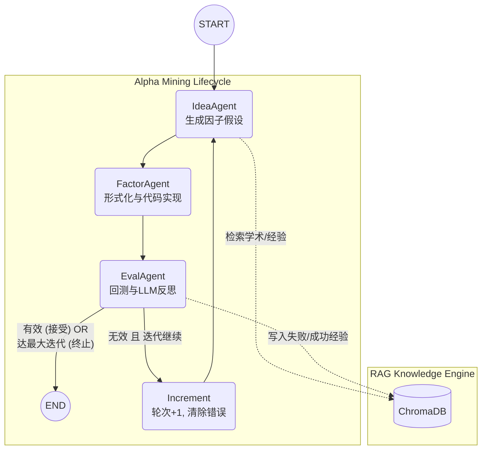
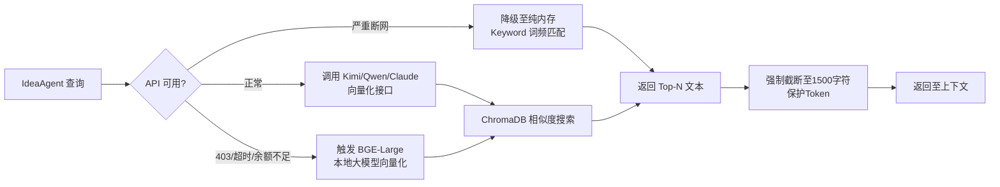

# AlphaMiner 深度技术说明书 (Comprehensive Technical Manual)

> 一个高度自动化、"Vibe-coded" 的量化 Alpha 因子挖掘框架。基于 **LangGraph** 构建有状态的多智能体（Multi-Agent）系统，结合 **RiceQuant/Qlib** 数据引擎与 **弹性 RAG** 检索技术，实现从“学术灵感检索”到“数学公式生成”，再到“金融回测与反思进化”的闭环自动化。

---

## 目录 (Table of Contents)

1. [项目简介 (Project Overview)](#1-项目简介-project-overview)
2. [项目目录结构 (Directory Structure)](#2-项目目录结构-directory-structure)
3. [核心技术栈 (Tech Stack)](#3-核心技术栈-tech-stack)
4. [系统架构与流程图 (Architecture & Flowcharts)](#4-系统架构与流程图-architecture--flowcharts)
5. [核心数据结构 (Data Structures)](#5-核心数据结构-data-structures)
6. [技术实现详解 (Technical Implementation)](#6-技术实现详解-technical-implementation)
7. [核心代码文件结构剖析 (Per-File Code Structure)](#7-核心代码文件结构剖析-per-file-code-structure)
8. [配置与启动指南 (Configuration & Execution)](#8-配置与启动指南-configuration--execution)

---

## 1. 项目简介 (Project Overview)

AlphaMiner 旨在模拟一个高级量化研究员的完整工作流。传统的量化研究依赖人工阅读论文、手写公式、构建代码并进行回测，过程繁琐。
本系统通过调度三个核心 AI Agent：
- **IdeaAgent**（充当策略研究员，负责看论文找灵感）
- **FactorAgent**（充当量化开发工程师，负责写代码）
- **EvalAgent**（充当回测工程师与风险控制，负责评判与反思）

它们在一个由 LangGraph 驱动的状态机中不断循环，自主试错并自我进化。

---

## 2. 项目目录结构 (Directory Structure)

```text
.
├── main.py                     # 系统总入口，处理命令行参数并启动 LangGraph 工作流
├── environment.yml             # Conda 环境定义文件
├── requirements.txt            # Pip 依赖清单
├── .env.example                # 环境变量配置模板
├── test_rq.py                  # 米筐 (RiceQuant) 连通性独立测试脚本
│
├── agents/                     # 核心多智能体 (Multi-Agent) 定义
│   ├── idea_agent.py           # 策略构思智能体
│   ├── factor_agent.py         # 数学形式化与代码生成智能体
│   └── eval_agent.py           # 回测执行与反思评估智能体
│
├── core/                       # 核心基础设施与中间件
│   ├── llm.py                  # 多厂商 LLM 统一适配器 (Kimi, Qwen, Claude)
│   ├── rag.py                  # 弹性检索增强生成模块 (支持云端与本地 Embedding)
│   └── alphaeval/              # 混合回测评估引擎
│       ├── __init__.py
│       ├── rq_eval.py          # RiceQuant 矩阵运算引擎 (核心回测逻辑)
│       ├── modeltester.py      # Qlib 本地回测主引擎
│       ├── combo.py            # 因子权重优化组合器 (WeightCalculator)
│       └── noise_proc.py       # 噪声注入处理器 (用于测试因子鲁棒性)
│
├── schemas/                    # 数据模型定义
│   └── messages.py             # Pydantic 模型，定义 LLM 结构化输出
│
├── workflow/                   # 状态机与工作流控制
│   ├── state.py                # 定义全局共享状态 (AlphaMinerState)
│   └── graph.py                # LangGraph 节点与路由拓扑定义
│
├── scripts/                    # 数据抓取与辅助脚本
│   ├── fetch_academic_papers.py # 自定义 arXiv 论文拉取
│   ├── fetch_arxiv_qfin.py      # 抓取 q-fin 分类前沿论文
│   ├── fetch_arxiv_with_pkg.py  # 备用 arxiv 拉取脚本
│   ├── fetch_market_metadata.py # 使用 AKShare 抓取当前 A 股市场元数据
│   └── download_qlib_data.py    # 下载本地 Qlib 离线数据
│
├── data/                       # 本地数据与知识库存储
│   ├── chroma_db/              # ChromaDB 向量持久化目录 (按 Embedding 模型分子目录)
│   └── rag_docs/               # 静态知识库文档
│       ├── academic/           # 学术论文与研报摘要
│       ├── alphas/             # 经典因子公式库 (WorldQuant 101, GTJA 191)
│       └── market_meta/        # 市场元数据与字段映射关系
│
└── results/                    # 运行结果存储
    └── results.json            # 历次迭代生成的因子代码与回测指标
```

---

## 3. 核心技术栈 (Tech Stack)

| 类别 | 技术/框架 | 作用说明 |
| :--- | :--- | :--- |
| **Agent 编排** | `langchain`, `langgraph` | 构建有状态的、支持分支和循环的 Agent 工作流图。 |
| **LLM 引擎** | `langchain-openai` | 提供统一的 OpenAI API 调用规范，无缝对接 Kimi/Qwen/Claude 代理。 |
| **结构化输出** | `pydantic` | 定义 Schema 强制约束 LLM 生成符合要求的 JSON 格式。 |
| **向量检索 (RAG)** | `chromadb` | 本地化轻量级向量数据库，用于存储静态知识与动态经验。 |
| **本地 Embedding**| `sentence-transformers` | 提供断网/无费用的本地高质量文本向量化 (如 `bge-large-zh-v1.5`)。 |
| **量化回测 (云端)**| `rqdatac` (RiceQuant) | 实时获取 A 股全市场日线数据，支持内置 Pandas 高性能矩阵运算引擎。 |
| **量化回测 (本地)**| `pyqlib` (Microsoft) | 本地高性能数据框架，处理复杂的交叉截面时序表达式。 |
| **科学计算** | `pandas`, `numpy`, `scipy`| 处理回测逻辑、相关性计算、协方差求取及 scipy.optimize 权重优化。 |

---

## 4. 系统架构与流程图 (Architecture & Flowcharts)

### 4.1 全局工作流拓扑 (Global Workflow Topology)



### 4.2 弹性 RAG 检索流程 (Elastic RAG Flow)



### 4.3 RiceQuant 矩阵计算引擎流程 (RQEval Flow)

```mermaid
graph TD
    Data[获取 rqdatac 原始数据<br>datetime, instrument, OHLCV] --> Unstack[解叠 Unstack<br>转换为宽表矩阵]
    Unstack --> Mapping[构建本地算子映射字典<br>Rank, Mean, Std, Corr, Ts_Rank...]
    Mapping --> Replace[替换字段符<br>$close -> fields['close']]
    Replace --> Eval[执行 Python Eval<br>进行全矩阵矢量运算]
    Eval --> Stack[重新堆叠 Stack<br>变回 MultiIndex]
    Stack --> Merge[与 Label 对齐<br>计算 IC/RankIC]
```

---

## 5. 核心数据结构 (Data Structures)

### 5.1 全局状态: `AlphaMinerState` (`workflow/state.py`)
LangGraph 中流转的核心字典。

| 字段 | 类型 | 说明 |
| :--- | :--- | :--- |
| `iteration` | `int` | 当前迭代轮次。 |
| `max_iterations` | `int` | 允许的最大挖掘轮次。 |
| `evaluation_mode`| `str` | 回测引擎选择：`qlib` 或 `ricequant`。 |
| `rag_context` | `str` | 暂存 RAG 检索返回的参考文本。 |
| `hypothesis_name`| `str` | IdeaAgent 产出的因子名称。 |
| `hypothesis_description`| `str`| 因子的详细理论描述。 |
| `rationale` | `str` | 因子背后的金融学或微观结构原理。 |
| `math_formula` | `str` | FactorAgent (Stage1) 产出的数学公式 (LaTeX风格)。 |
| `code_expression`| `str` | FactorAgent (Stage2) 产出的 Qlib 格式 Python 表达式。 |
| `backtest_metrics`| `Dict` | 回测结果集合，含 `information_coefficient`, `rank_ic` 等。 |
| `is_effective` | `bool` | EvalAgent 综合判定该因子是否可用。 |
| `suggested_improvements`| `str`| 反思结论，指导下一轮构思的改进方向。 |
| `messages` | `List[str]`| 累积执行日志（由 LangGraph Reducer `operator.add` 合并）。 |

### 5.2 结构化输出 Pydantic 模型 (`schemas/messages.py`)
用于约束 LLM 的输出。
- **`HypothesisOutput`**: 包含 `hypothesis_name`, `hypothesis_description`, `rationale`。
- **`FormalizationOutput`**: 包含 `math_formula` (如 $\sigma(R_t, 20)$) 和 `variables_defined` (字典定义)。
- **`ImplementationOutput`**: 包含 `code_expression` (如 `Std($close, 20)`) 和语法有效性自评 `is_valid_syntax`。
- **`ReflexiveReviewOutput`**: 包含 `review_summary` (包含度量数值的分析), `is_effective` (严格判定), `suggested_improvements` (可操作性修改建议)。

---

## 6. 技术实现详解 (Technical Implementation)

### 6.1 多厂商 LLM 与深度思考 (`core/llm.py`)
系统通过工厂函数 `get_llm()` 提供动态模型调度：
- 采用 `langchain_openai.ChatOpenAI` 作为底层驱动，兼容任何 OpenAI 标准的接口。
- **智能分流**：
  - 若 `provider="kimi"`：连接 `https://api.moonshot.cn/v1`，默认拉起 `kimi-k2-thinking-turbo`，生成极其深度的因果推理。
  - 若 `provider="qwen"`：连接阿里云 DashScope。
  - 若 `provider="claude"`：连接自定义代理接口。

### 6.2 弹性 RAG 模块 (`core/rag.py`)
- **生命周期**：在系统启动时，递归扫描 `data/rag_docs` 下的 markdown，按段落分割 (Chunking)。
- **维度安全管理**：Kimi 返回 1536 维，而本地 bge-large 只有 1024 维。代码中通过 `self.db_dir = os.path.join(db_dir, model_tag)` 在磁盘物理隔离不同维度的 ChromaDB 实例，杜绝启动报错。
- **三重容错 (Triple Fallback)**：
  1. `_safe_query` 调用外部 Embedding。
  2. 捕获 `403/Timeout`，尝试拉起 `sentence-transformers` 进行本地嵌入。
  3. 捕获内存不足/模型损坏，退化为 `_local_keyword_retrieval` 纯内存集合重叠打分法 (BM25 替代方案)。
- **经验闭环**：`add_experience` 会将失败因子的公式、回测 IC、改进建议编码成新向量注入 `experiences` 表。IdeaAgent 在生成时会被强制提示“Do not repeat failed past experiences.”。

### 6.3 EvalAgent 反思与评估逻辑 (`agents/eval_agent.py`)
- 调度回测引擎 (`AlphaEval` 或 `RiceQuantEval`) 取得纯粹的数值字典。
- 利用 LLM 读取数值和原始假说，判断是否发生**信号背离** (例如 IC 为负但 RankIC 为正，说明极端值影响大)。
- 产出高价值的 `suggested_improvements` 注入到图的下一轮状态，形成 **Reflexive Loop**。

### 6.4 RQEval 高性能矩阵引擎 (`core/alphaeval/rq_eval.py`)
- 传统的日度循环计算因子耗时巨大。本系统在 `compute_factors` 阶段：
  1. 调用米筐获取多股票长时间的 MultiIndex DataFrame。
  2. 对每一列使用 `.unstack()` 展开为以 Date 为索引，Instrument 为列的 $T \times N$ 大矩阵。
  3. 定义内部函数库重写算子：`Rank` -> `df.rank(axis=1, pct=True)`，`Mean` -> `df.rolling(n).mean()`，`Corr` -> `df1.rolling(n).corr(df2)`。
  4. 利用 Python 内置 `eval(expr, context)` 在矩阵空间一次性秒级求出所有历史日期的因子值。

---

## 7. 核心代码文件结构剖析 (Per-File Code Structure)

### `main.py`
- **核心职能**：配置日志、解析命令行参数、调用图构建器、启动流式迭代并记录结果。
- **内部流程**：
  - `setup_logging`: 初始化 loguru。
  - `save_results`: 将每一轮的最佳结果/错误序列化至 JSON 供离线分析。
  - `print_summary`: 在控制台高亮输出最终结论（IC、反思、代码）。
  - `main`: `argparse` 接管输入，定义 `initial_state`，调用 `app.stream()` 并捕获状态流转。

### `workflow/graph.py`
- **核心职能**：定义节点及边，构建 LangGraph 实例。
- **函数结构**：
  - `route_after_idea`: 检查 `error`，决定流向 `factor_agent` 还是 `end`。
  - `route_after_factor`: 检查语法标志，决定流向 `eval_agent`。
  - `route_after_eval`: 判断轮次 `iteration < max_iterations`，决定 `increment` 回流还是终止。
  - `increment_iteration`: 更新计数器并清理瞬态异常。
  - `build_workflow`: 实例化所有的 Agent，并将它们注册入 `StateGraph`，编译返回 `Runnable` 图。

### `agents/idea_agent.py`
- **类结构**: `IdeaAgent`
- **依赖注入**: `rag_module`, `provider`, `model`.
- **`__call__(self, state)`**: 
  - 从 `state` 提取 `previous_improvements` 和当前 `mode`。
  - **动态行情注入**：若在米筐模式下，实例化 `RiceQuantEval().get_market_regime()` 抓取当前 30 天 A 股的波动率与量价趋势文本，并合入 RAG 上下文中。
  - 构建含有 RAG 上下文的系统 Prompt，要求 LLM 输出 `HypothesisOutput` JSON。

### `agents/factor_agent.py`
- **类结构**: `FactorAgent`
- **成员常量**: `QLIB_OPERATORS` 和 `QLIB_FIELDS` 记录了系统支持的所有安全算子和数据字段。
- **`__call__(self, state)`**:
  - **Stage 1**: 用 LLM 解析金融理论，产出数学公式体系 (LaTeX 表达)。
  - **Stage 2**: 第二次调用 LLM，严格参照 Qlib 算子库将数学式子翻译成一行代码（如 `If(Greater($volume, Mean($volume, 20)), 1, -1)`）。
  - 调用静态方法 `_validate_qlib_expression` 做基于抽象语法树的括号平衡性和操作数校验。

### `agents/eval_agent.py`
- **类结构**: `EvalAgent`
- **核心方法 `_execute_alphaeval_backtest(code, mode)`**: 
  - 根据 `mode` 动态分发。若为 `ricequant`，调用 `RiceQuantEval`，否则调用 `AlphaEval`。
  - 若抛出缺失数据/余额不足/断网异常，捕捉并回退至**确定性种子随机模拟器**（基于代码 Hash），生成虚拟指标以保证框架运行不中断（并在日志告警）。
- **`__call__(self, state)`**:
  - 获取回测数值后，调用第三个 LLM Prompt 进行复盘打分，结构化返回 `ReflexiveReviewOutput`。
  - 触发 `self.rag.add_experience` 持久化写入 ChromaDB。

### `core/alphaeval/rq_eval.py`
- **类结构**: `RiceQuantEval`
- **关键方法**:
  - `_init_rq`: 包含三阶自适应登录逻辑 (Token Keyword -> Token Positional -> Token URI -> Password)，解决各类 SDK 历史遗留验证问题。
  - `fetch_data`: 从云端拉取 `000300.XSHG` 成分股，规整化为标准的 (datetime, instrument) 二重索引。
  - `compute_factors`: 定义基于 Pandas 的矩阵运算器，处理动态 Eval。
  - `get_market_regime`: 生成面向 LLM 友好的行情文本描述 (Bullish/Bearish, High/Low Volatility)。
  - `run`: 调用上述流程并得出时序平均的 IC/RankIC。

### `core/rag.py`
- **类结构**: `RAGModule`
- **核心逻辑**:
  - `__init__`: 处理 `embedding_provider` 参数，利用 `SentenceTransformerEmbeddingFunction` 下载或拉起本地 BGE-Large 模型，或者链接云端 API。创建专用的 `db_dir`。
  - `_init_knowledge_base`: 块级切割 (Chunking)，附带文件名元数据持久化插入 Chroma。
  - `retrieve`: 实现 `_safe_query` 和容错回退机制。
  - `_local_keyword_retrieval`: 自研的零依赖内存词频打分重叠算法。

---

## 8. 配置与启动指南 (Configuration & Execution)

### 8.1 环境变量配置 (`.env`)
系统根目录下创建 `.env`，填入所需凭证：

```bash
# LLM 引擎密钥 (至少填一个)
LLM_KEY="your_kimi_moonshot_key"
QWEN_API_KEY="your_aliyun_qwen_key"
ClaudeCode_KEY="your_gptsapi_proxy_key"

# 米筐登录凭证 (如果使用 ricequant 模式)
# 推荐使用 Token 形式
RQ_TOKEN="your_super_long_license_key"
# 备选账号密码
RQ_USER="13800138000"
RQ_PASS="your_password"

# 强制开启本地开源的 Embedding 引擎 (节省调用费)
USE_LOCAL_EMBEDDING="true"
```

### 8.2 安装系统依赖
```bash
pip install -r requirements.txt
# 开启本地 RAG 必需
pip install sentence-transformers
```

### 8.3 启动命令全家桶

**参数表**：
| 参数 | 类型 | 说明 |
| :--- | :--- | :--- |
| `--iterations` | int | 执行多几轮闭环迭代，默认为 1。 |
| `--mode` | str | `ricequant` (米筐云数据) 或 `qlib` (本地高频数据)。 |
| `--llm-provider`| str | 强制指定大模型底层: `kimi`, `qwen`, `claude`。 |
| `--llm-model` | str | 强制指定模型名，如 `kimi-k2-thinking-turbo`。 |
| `--embedding-provider`| str | 强制指定向量底层: `local`, `kimi`, `qwen`, ... |
| `--rebuild-rag` | flag | 扫描 `rag_docs` 并重新索引数据库。 |
| `--verbose` | flag | 输出底层 Debug 级别极详细日志。 |

**最佳推荐执行指令 (Kimi 深度思考 + 米筐云端测评 + 零成本本地 RAG)：**
```bash
python main.py --iterations 3 --mode ricequant \
  --llm-provider kimi \
  --llm-model kimi-k2-thinking-turbo \
  --embedding-provider local
```

**快速轻量运行指令 (Qwen 极速模型 + Qlib 本地数据)：**
```bash
python main.py --iterations 2 --mode qlib \
  --llm-provider qwen \
  --llm-model qwen-plus
```

> **注意：** 首次使用 `--embedding-provider local` 时，系统将通过 Hugging Face 自动下载 `BAAI/bge-large-zh-v1.5` 权重文件 (约1.3GB)，请保持网络通畅。

---
**文档版本**: 3.0
**最新更新**: 全架构解析、RQ 矩阵引擎与混合 RAG 参数化方案。