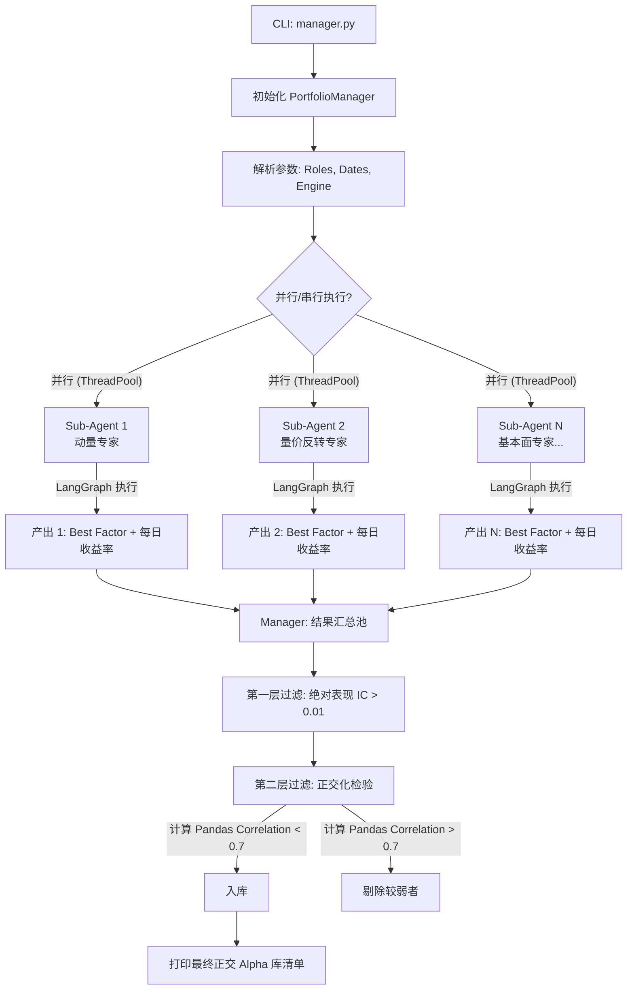
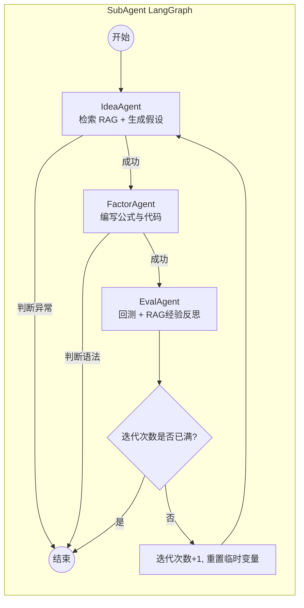

# 🚀 AI Alpha Miner: 核心架构与全栈技术深度剖析全手册 (v2.0)

## 📖 1. 项目概述与核心愿景
**AI Alpha Miner Swarm** 是一个基于大语言模型（LLM）高级推理能力驱动的端到端自动化量化因子发现系统。系统摒弃了传统的单线程线性搜索，采用了 **主从架构 (Master-Slave Swarm)**。通过该架构，系统模拟了一个由多名具备不同专业背景的“虚拟研究员”组成的量化基金团队。

系统的核心逻辑生命周期为：**“专业化角色分工 -> 深度 RAG 检索 -> 因子假设生成 -> 数学形式化与代码翻译 -> 沙箱矩阵回测 -> 结果汇总筛选 -> 收益率相关性剔除（正交化）”**。

---

## 🛠️ 2. 技术栈 (Tech Stack)

### 2.1 核心框架
*   **编排与代理框架**: [LangGraph](https://github.com/langchain-ai/langgraph) (用于构建带状态的循环图流) 和 [LangChain](https://github.com/langchain-ai/langchain) (用于 LLM 工具链)。
*   **大语言模型接口**: 支持多种 API (智谱 GLM, 月之暗面 Kimi, 阿里 Qwen, Anthropic Claude)。
*   **结构化输出**: `Pydantic` (强制 LLM 返回符合 Schema 的 JSON 对象)。

### 2.2 存储与检索增强 (RAG)
*   **向量数据库**: [ChromaDB](https://www.trychroma.com/) (本地持久化存储，无需部署复杂服务)。
*   **嵌入模型 (Embedding)**: 支持本地部署 `BAAI/bge-large-zh-v1.5` / `Qwen3-Embedding-4B`，或通过 API 调用云端 Embedding 模型。

### 2.3 量化引擎与数据科学
*   **量化数据与回测引擎**: 
    *   [RiceQuant (rqdatac)](https://www.ricequant.com/) (针对 A 股的线上高频及日线数据拉取与回测)。
    *   [Qlib](https://github.com/microsoft/qlib) (微软开源 AI 量化投资平台，用于离线环境)。
*   **数据结构与矩阵计算**: `Pandas`, `NumPy`。
*   **抽象语法树安全解析**: `ast` (Python 內置模块，用于将 LLM 生成的代码安全解析为可计算的语法树)。
*   **并发执行**: Python `concurrent.futures.ThreadPoolExecutor` (用于主从架构的多子 Agent 并行)。

---

## 📁 3. 完整项目结构与代码架构分布

```text
/
├── manager.py             # 【主控入口】负责任务角色分发、多线程并发执行、Alpha 正交化去重
├── sub_agent.py           # 【子 Agent 封装】实例化单人研究员，管理独立的 LangGraph 运行
├── main.py                # (历史保留) 单 Agent 传统执行入口
├── workflow/
│   ├── graph.py           # 状态图流转定义：Idea -> Factor -> Eval -> (Increment)
│   └── state.py           # TypedDict：跨节点流转的全局状态字典 (AlphaMinerState)
├── agents/
│   ├── idea_agent.py      # 【大脑】结合 RAG 和宏观行情，提出因子逻辑假设 (JSON)
│   ├── factor_agent.py    # 【程序员】将文本假设严谨转化为 Qlib 格式代码 (双层重试)
│   └── eval_agent.py      # 【质检员】调用底层评估引擎，输出 IC/RankIC/DailyReturns 及反思改进
├── core/
│   ├── llm.py             # LLM API 路由、Key 管理与初始化
│   ├── rag.py             # ChromaDB 操作类，负责文档切割、向量化、检索、历史经验存储
│   └── alphaeval/
│       ├── rq_eval.py     # 基于 RiceQuant 数据的高性能矩阵回测引擎，内置因子安全执行器
│       ├── modeltester.py # 兼容 Qlib 环境的 AlphaEval 引擎
│       ├── combo.py       # 等权或优化权重的多因子组合逻辑
│       └── noise_proc.py  # (实验性) 噪声处理工具
├── schemas/
│   └── messages.py        # Pydantic Schema，严格规范各个 Agent LLM 的输出字段
├── data/
│   ├── chroma_db/         # Chroma 向量库物理文件存储
│   └── rag_docs/          # 供 RAG 读取的 Markdown 知识库 (文献、研报、因子库等)
└── logs/                  # 运行时日志持久化目录
```

---

## 📊 4. 系统全局流程图 (Mermaid Flowcharts)

### 4.1 全局主从协作架构 (Manager-SubAgent Swarm)
Manager 作为集群的中心，分配任务并回收最终产出。



### 4.2 子 Agent 内部图谱流转 (LangGraph Sub-Workflow)
每个 SubAgent 内部是一个闭环的状态机，它最多会迭代 `max_iterations` 次。



---

## 🗂️ 5. 核心数据结构详解 (Data Structures)

### 5.1 全局状态字典 (`workflow/state.py` -> `AlphaMinerState`)
这是贯穿整个 LangGraph 图的神经中枢，使用了 Python 的 `TypedDict` 定义。

| 字段名 | 数据类型 | 描述 |
| :--- | :--- | :--- |
| `iteration` | `int` | 记录当前循环处于第几次迭代。 |
| `max_iterations` | `int` | 设定的单 Agent 最大探索次数。 |
| `role_prompt` | `str` | **关键**: Manager 分配给子 Agent 的性格设定（如“动量专家”）。 |
| `rag_context` | `str` | 从 ChromaDB 检索出的论文知识与历史失败经验拼接文段。 |
| `market_regime_summary` | `str` | RiceQuant 引擎计算出的宏观市场画像（波动率、偏度等）。 |
| `hypothesis_name` | `str` | LLM 生成的因子假说名称。 |
| `hypothesis_description` | `str` | LLM 生成的因子假说具体内容和逻辑原理。 |
| `code_expression` | `str` | FactorAgent 输出的可执行 Python 表达式字符串。 |
| `backtest_metrics` | `Dict[str, float]` | 回测指标（如 IC, Rank_IC, Sharpe）。 |
| `daily_returns` | `Dict[str, float]` | **核心**: 因子每日组合收益序列，格式为 `{"2020-01-01": 0.05, ...}`，Manager 用其计算多因子的皮尔逊相关系数。 |
| `is_effective` | `bool` | Reflexive Review 判定的策略是否有效。 |
| `suggested_improvements`| `str` | Review 节点给出的修改建议，将传入下一轮 IdeaAgent。 |

### 5.2 结构化输出 Pydantic Schema (`schemas/messages.py`)
使用 Pydantic 类配合 `ChatPromptTemplate` 约束大模型输出严格的 JSON。
*   `HypothesisOutput`: 必须包含 `hypothesis_name`, `hypothesis_description`, `rationale`。
*   `FormalizationOutput`: 必须包含 `math_formula` 和 `variables_defined`（变量解释字典）。
*   `ImplementationOutput`: 必须包含 `code_expression` 和 `is_valid_syntax` (Bool)。
*   `ReflexiveReviewOutput`: 必须包含 `review_summary`, `is_effective`, `suggested_improvements`。

---

## 🧬 6. 文件与函数级深度剖析

### 6.1 主控协同模块

#### `manager.py`
系统的最高决策中心，负责启动、分发和验收工作。
*   **`PortfolioManager.__init__(self, roles, **kwargs)`**: 
    *   接收外部传入的命令行参数（如日期、大模型提供商）并保存在 `kwargs` 中透传。初始化 `self.roles`（研究方向列表）和 `self.alpha_pool`。
*   **`dispatch_tasks(self)`**: 
    *   遍历 `roles` 列表，为每一个角色实例化一个 `AlphaResearcher` 打工人对象，将它们存入 `self.researchers` 列表。
*   **`evaluate_and_combine(self, results_list)`**: 
    *   **系统的去重核心（正交化 Backbone）**。
    *   首先过滤掉执行报错或 `IC < 0.01` (默认阈值) 的垃圾因子。
    *   然后进入双重循环：将新进因子的 `daily_returns`（字典）转换为 Pandas Series。针对 `final_pool` 中的每一个已有因子，使用 `pd.concat([new, existing], axis=1, join='inner').corr()` 计算两者的收益率时间序列相关系数。
    *   若相关系数 $> 0.7$，判定为“同质化策略”，直接舍弃（Culled）；否则加入 `final_pool`。
*   **`run_swarm(self, parallel=False)`**: 
    *   若 `parallel=True`，使用 `concurrent.futures.ThreadPoolExecutor` 并发调用所有打工人的 `run()` 方法。若为 False，则串行调用（适合本地显存有限的部署）。最后调用评估核心。

#### `sub_agent.py`
将复杂的 LangGraph 流程封装为一个黑盒任务。
*   **`AlphaResearcher.__init__(self, ...)`**: 
    *   接收 `role_prompt` 并保存。核心是调用 `build_workflow(...)` 实例化一个完全隔离的 LangGraph 对象 `self.app`，避免跨进程状态污染。
*   **`AlphaResearcher.run(self)`**: 
    *   初始化子 Agent 的专属 `initial_state`（包含特定的角色 prompt）。
    *   调用 `self.app.stream(initial_state)` 跑完所有迭代。
    *   抓取最后状态中的 `backtest_metrics` 和 `daily_returns`，封装为标准的 Dict 结构返回给 Manager。

---

### 6.2 LangGraph 编排模块

#### `workflow/graph.py`
定义工作流的节点和有向边。
*   **`route_after_idea`**, **`route_after_factor`**, **`route_after_eval`**: 
    *   **路由函数 (Router Functions)**。根据 State 中的 `error` 字段决定走向下一步还是走向 `END` 终止图谱。特别是在 `route_after_eval` 中，判断 `iteration < max_iterations` 来决定是循环回到 `increment` 节点还是结束。
*   **`increment_iteration(state)`**: 
    *   状态步进节点。将 `iteration` 加 1，并清空上一次执行的临时报错和语法验证标记，准备进入下一轮的 `IdeaAgent`。
*   **`build_workflow(...)`**: 
    *   系统的核心组装器。在这里实例化单例的 `RAGModule` 和三大实体 Agent (`IdeaAgent`, `FactorAgent`, `EvalAgent`)。使用 `StateGraph(AlphaMinerState)` 绑定状态，通过 `add_node` 和 `add_conditional_edges` 连接出逻辑闭环，最后返回编译好的 `app`。

---

### 6.3 实体研究员 Agent 模块

#### `agents/idea_agent.py`
挖掘大脑，负责“胡思乱想”与提出假设。
*   **`IdeaAgent.__init__`**: 绑定 RAG 引擎和 LLM。
*   **`__call__(self, state)`**:
    *   **知识组装**: 调用 `rag.retrieve` 搜取文献。若为 RiceQuant 模式，调用底层的 `rq_eval.get_market_regime` 动态计算回测期内的市场画像（波动率、偏度、MACD趋势），拼接成庞大的 Prompt Context。
    *   **角色注入**: 从 `state.get("role_prompt")` 获取老板布置的方向，替换默认的 System Message 角色设定。如果上一轮失败了，还将拼接 `suggested_improvements` 进行反思。
    *   输出解析为 `HypothesisOutput` JSON 对象，写入状态的 `hypothesis_name` 等字段。

#### `agents/factor_agent.py`
苦逼的程序员，负责将大白话翻译成严格的 Qlib 矩阵表达式。
*   **静态验证方法 `_validate_qlib_expression(expr)`**: 检查左右括号是否匹配，是否包含了数据字段 `$xxx`。
*   **`__call__(self, state)`**:
    *   **阶段一 (数学形式化)**: LLM 提炼纯文字逻辑，生成严谨的纯数学公式（`math_formula`）。
    *   **阶段二 (代码实现)**: 给定极其严格的白名单提示词（`self.QLIB_OPERATORS`, `self.QLIB_FIELDS`）。
    *   **自我重试环**: 若输出的代码经正则和基础验证不合格，Agent 会**携带报错原因自动发起重试 (Retry)**，最多重试 2 次，大幅降低了无效代码送入回测引擎的概率。

#### `agents/eval_agent.py`
冷酷无情的裁判，测试因子的真假。
*   **`_execute_alphaeval_backtest(self, code, mode)`**: 
    *   根据模式初始化 `RiceQuantEval` 或 `AlphaEval` 对象，调用 `.run()` 执行回测。捕获引擎抛出的 `daily_returns` 和 IC 等指标。如果遇到极端语法错误导致引擎崩溃，会接管异常并利用 Hash Seed 返回一个模拟得分（防中断机制）。
*   **`__call__(self, state)`**:
    *   先调用回测拿到 Metrics。
    *   构建反思 Prompt (Reflexive Review Module)：让 LLM 充当“量化研究总监”，审视 Hypothesis 和跑出的 IC，判定是否真正 Effective，并输出下一轮改进建议。
    *   最后调用 `self.rag.add_experience` 将这段血泪史存入向量数据库，并返回更新后的 State 字典（携带 `daily_returns` 交给老板）。

---

### 6.4 核心支持基础设施

#### `core/rag.py`
检索增强生成（RAG）大本营，管理知识记忆。
*   **`RAGModule.__init__`**: 智能适配 Embedding。若强制要求本地跑，默认挂载 `Qwen3-Embedding-4B`；否则根据 LLM Provider (如 Kimi, GLM) 自动申请对应的线上 Embedding API 密钥并初始化 OpenAI 格式的调用。
*   **`_chunk_text(text)`**: 按段落和字符数量，对长研报/文献进行粗切分。
*   **`_init_knowledge_base(self)`**: 启动时扫描 `data/rag_docs` 下所有的 Markdown 文件，执行嵌入（Embedding），存入 ChromaDB 的 `knowledge_base` Collection。
*   **`retrieve(query, n_results)`**: 分别从知识库和过去经验库检索 Top N 相似切片拼接返回。
*   **`add_experience(hypothesis, code, metrics, is_effective, review)`**: 将 Agent 刚刚跑完的一次因子生命周期压缩为纯文本，附带 IC 数据作为 Metadata 插入 `experiences` 集合。这是系统“记忆”和“进化”的源泉。

#### `core/llm.py`
多模型路由网关。
*   **`get_llm_config`**: 从 `os.getenv` 读取各类 Key，动态判断并返回选定的 Provider（Kimi, Qwen, GLM, Claude）。
*   **`get_llm`**: 配置 LangChain 的 `ChatOpenAI` 适配器实例，统一下发 BaseURL、API_KEY 和模型名称。

#### `core/alphaeval/rq_eval.py`
基于 RiceQuant 的**高性能矩阵式因子计算与回测引擎**。
*   **`SafeEvalTransformer(ast.NodeTransformer)`**: 安全沙箱。对于 LLM 胡编乱造的未知函数或变量名（如 `Sector`），遍历抽象语法树并将其隐式转换为无害的字符串字面量，防止 `eval()` 执行注入攻击或因未定义变量崩溃。
*   **`fetch_data(self)`**: 通过 `rqdatac` 拉取指定市场标的（如中证300）的 `OHLCV` 行情。拉取后执行 `df.unstack()`，将一维长表转换为宽表矩阵，行为 DateTime，列为 Instrument。
*   **`compute_factors(self)`**: 
    *   在函数内部定义了 30 余个符合 Qlib 签名的本地 Python 函数，如 `Rank`, `Ref`, `Delta`, `If`, `Corr`。这些函数大部分都通过 `pandas.DataFrame` 或 `rolling` 方法实现了全切面（Cross-sectional）或时间序列（Time-Series）的矢量化操作。
    *   通过 `ast.parse` 和 `eval()`，动态执行被字符串替换过的表达式代码，输出因子值的 DataFrame。
*   **`get_market_regime(self, start, end)`**: 数据分析预处理工具。利用近期日K线，计算波动率、偏度、峰度、均线偏离度，输出一段文字化的大盘诊断给 IdeaAgent 作灵感。
*   **`run(self)`**: 主回测流。将计算出的因子矩阵与下一个交易日收益率标签（Label）做按日匹配合并。
    *   分别计算逐日横截面普通皮尔逊相关系数（IC）和斯皮尔曼秩相关系数（RankIC），最后求均值。
    *   **每日收益率计算**: `(x["factor"] * x["label"]).sum() / (x["factor"].abs().sum() + 1e-8)`，这一步假定进行每日横截面 Z-Score 后作全额无杠杆多空对冲，生成了 `self.daily_returns` 供上层做正交化剥离。

---

## ⚙️ 7. 安装与启动指南 (Setup & Execution)

### 7.1 环境依赖
请确保系统中安装了 Conda。由于涉及到 ChromaDB、Pandas 等 C++ 扩展，推荐严格按照环境文件构建：
```bash
conda env create -f environment.yml
conda activate aiminer
pip install -r requirements.txt
```

### 7.2 环境变量配置 (.env)
在项目根目录新建 `.env` 文件，输入你需要使用的 LLM API Key 和数据源账密：
```env
# 大模型配置 (填入你拥有的即可)
GLM_KEY="你的智谱AI_API_KEY"
LLM_KEY="你的Kimi_API_KEY"
QWEN_API_KEY="你的阿里云百炼_API_KEY"

# 数据源配置 (如果使用 ricequant 模式必须填写)
RQ_USER="你的RiceQuant账号"
RQ_PASS="你的RiceQuant密码"
```

### 7.3 一键启动命令集群挖掘
推荐使用强大的 API 大模型，并使用 `--parallel` 并发全速挖掘。下方命令启动了 3 个截然不同的研究方向，每个方向将独立探索迭代 20 次。

```bash
python manager.py --iterations 20 \
--mode ricequant \
--llm-provider glm --llm-model glm-4 \
--market-start 2021-01-01 --market-end 2021-12-31 \
--roles \
"利用 Hurst 指数进行时间序列动量研究的专家" \
"专注日内高频波动率偏斜与流动性错配的专家" \
"利用 HMM 隐马尔可夫模型进行市场状态识别的专家" \
--parallel
```

执行完毕后，控制台将输出所有合格且**互相正交**的高质量 Alpha 因子池，并将它们的最佳表达式和收益表现持久化留存。