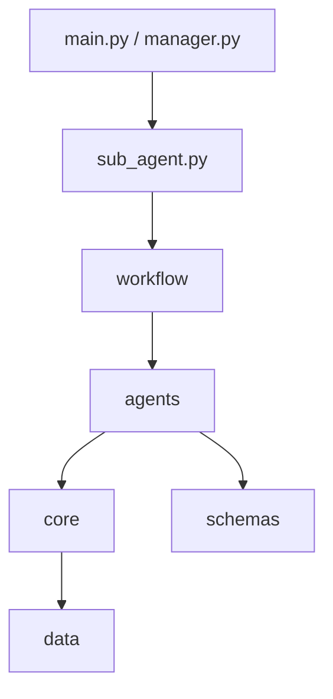
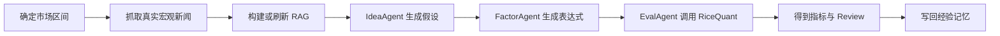
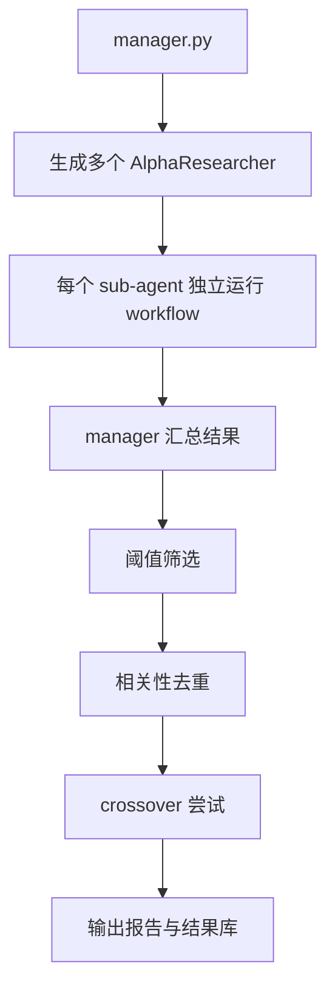

# AI Alpha Miner

> 一个面向量化因子研究的多智能体系统。  
> 它把“想因子、写表达式、做评估、沉淀经验”拆成一条可重复执行的工作流，并用真实市场数据与真实新闻上下文来增强研究过程。

## 项目简介

AI Alpha Miner 不是单纯让大模型“凭空生成一个公式”，而是把因子研究拆成几个更稳定的阶段：

1. 先读取市场区间、宏观新闻、RAG 知识文档和历史经验
2. 再由 `IdeaAgent` 提出因子假设
3. 由 `FactorAgent` 把假设转成可执行表达式
4. 由 `EvalAgent` 调用 RiceQuant 做真实评估
5. 最后把结果写回经验记忆，供下一轮继续参考

当前版本已经统一为 `RiceQuant-only`，不再保留 Qlib 作为运行路径。

---

## 核心能力

| 能力 | 说明 |
| --- | --- |
| 多智能体协作 | 支持 `manager + sub_agent` 主从架构，可为每个子代理指定不同研究方向 |
| 工作流编排 | 使用 LangGraph 组织 `idea -> factor -> eval -> review` 链路 |
| 真实评估 | 通过 RiceQuant 获取真实市场数据并评估因子效果 |
| 真实新闻增强 | 运行前按时间区间抓取真实财经/宏观新闻，写入 RAG |
| RAG 检索 | 结合论文、新闻、市场元数据、alpha 文档和历史经验做上下文增强 |
| 结构化输出 | 用 Pydantic schema 约束 agent 输出，减少自由文本漂移 |
| 经验沉淀 | 将有效/无效研究结果写入分层经验记忆，支持后续检索与复用 |

---

## 系统结构



### 目录说明

| 目录 | 作用 |
| --- | --- |
| `agents/` | 业务代理：想法生成、因子实现、评估、总结 |
| `core/` | 基础能力：LLM、RAG、RiceQuant 评估 |
| `workflow/` | 工作流图和共享状态定义 |
| `schemas/` | 结构化输出约束 |
| `scripts/` | 数据抓取与离线准备脚本 |
| `tests/` | 单元测试与连接测试 |
| `data/` | RAG 文档、经验库、测试数据、运行产物 |

---

## 两种运行方式

### 1. `main.py`

单条研究链路入口。  
适合单次实验、调试和观察完整 workflow。

### 2. `manager.py`

Swarm 调度入口。  
适合让多个不同角色的子代理并行探索，再由 manager 统一筛选、去重、组合和输出报告。

### 3. `sub_agent.py`

子代理执行单元。  
每个 sub-agent 本质上都会跑同一条 workflow，只是角色设定和上下文不同。

---

## 工作流



如果运行的是 `manager.py`，流程会在这个基础上再加一层主从调度：



---

## 数据来源

### 市场数据

- 来源：RiceQuant
- 位置：[`core/alphaeval/rq_eval.py`](/c:/Users/18709/Desktop/quantgit/core/alphaeval/rq_eval.py)
- 用途：行情获取、因子计算、IC / Rank IC 评估、市场状态总结

### 宏观/财经新闻

- 来源：Google News RSS
- 位置：[`scripts/fetch_macro_news.py`](/c:/Users/18709/Desktop/quantgit/scripts/fetch_macro_news.py)
- 用途：运行前抓取指定时间区间内的真实新闻，并落到 `data/rag_docs/macro_news/<year>/`

### 论文与长期知识文档

- 来源：本地文档 + 脚本抓取
- 相关脚本：
  - [`scripts/fetch_academic_papers.py`](/c:/Users/18709/Desktop/quantgit/scripts/fetch_academic_papers.py)
  - [`scripts/fetch_arxiv_qfin.py`](/c:/Users/18709/Desktop/quantgit/scripts/fetch_arxiv_qfin.py)
  - [`scripts/fetch_arxiv_with_pkg.py`](/c:/Users/18709/Desktop/quantgit/scripts/fetch_arxiv_with_pkg.py)

---

## 所谓“实时拉取”是什么意思

这里的“实时”不是高频交易那种 tick 级实时流，而是：

- 在程序运行时
- 按你给定的市场时间区间
- 现场去拉取当前可用的真实数据

也就是说，它强调的是 `run-time fetch` 或 `on-demand fetch`，而不是完全依赖本地预存的静态样本。

默认情况下，如果你不手动传 `--market-start`，系统会回看过去一年。

---

## 安装

当前以 [`environment.yml`](/c:/Users/18709/Desktop/quantgit/environment.yml) 作为依赖来源：

```bash
conda env create -f environment.yml
conda activate aiminer
```

---

## 环境变量

在根目录创建 `.env`：

```env
QWEN_API_KEY=your_qwen_api_key
QWEN_MODEL=qwen-plus
QWEN_BASE_URL=https://dashscope.aliyuncs.com/compatible-mode/v1

RQ_USER=your_ricequant_username
RQ_PASS=your_ricequant_password
RQ_TOKEN=your_ricequant_token
```

说明：

- LLM 可以通过命令行参数覆盖 provider / model
- RiceQuant 支持 `RQ_TOKEN` 或 `RQ_USER + RQ_PASS`

---

## 快速开始

### 单次运行

```bash
python main.py --iterations 1 --llm-provider qwen
```

### 指定市场区间

```bash
python main.py --market-start 2025-04-01 --market-end 2026-04-08 --llm-provider qwen
```

### 多子代理并行

```bash
python manager.py --iterations 2 --parallel --llm-provider qwen
```

---

## 测试

当前测试包括：

- [`tests/test_agent_validation.py`](/c:/Users/18709/Desktop/quantgit/tests/test_agent_validation.py)
  - 测因子表达式是否合法
- [`tests/test_operators.py`](/c:/Users/18709/Desktop/quantgit/tests/test_operators.py)
  - 测底层算子实现和数值行为
- [`tests/test_rag.py`](/c:/Users/18709/Desktop/quantgit/tests/test_rag.py)
  - 测 RAG 基础切块与检索
- [`tests/test_rq_connection.py`](/c:/Users/18709/Desktop/quantgit/tests/test_rq_connection.py)
  - 测 RiceQuant 凭证和连接

其中 `test_rq_connection.py` 依赖真实凭证和外部服务，因此它更接近“环境测试”，不是纯离线单元测试。

---

## 推荐阅读顺序

如果第一次看代码，建议按这个顺序：

1. [`manager.py`](/c:/Users/18709/Desktop/quantgit/manager.py)
2. [`sub_agent.py`](/c:/Users/18709/Desktop/quantgit/sub_agent.py)
3. [`workflow/graph.py`](/c:/Users/18709/Desktop/quantgit/workflow/graph.py)
4. [`workflow/state.py`](/c:/Users/18709/Desktop/quantgit/workflow/state.py)
5. [`agents/idea_agent.py`](/c:/Users/18709/Desktop/quantgit/agents/idea_agent.py)
6. [`agents/factor_agent.py`](/c:/Users/18709/Desktop/quantgit/agents/factor_agent.py)
7. [`agents/eval_agent.py`](/c:/Users/18709/Desktop/quantgit/agents/eval_agent.py)
8. [`core/alphaeval/rq_eval.py`](/c:/Users/18709/Desktop/quantgit/core/alphaeval/rq_eval.py)
9. [`core/rag.py`](/c:/Users/18709/Desktop/quantgit/core/rag.py)
10. [`schemas/messages.py`](/c:/Users/18709/Desktop/quantgit/schemas/messages.py)

---

## 更多说明

更详细的架构说明、模块职责、数据流和文档结构说明见 [`instruction.md`](/c:/Users/18709/Desktop/quantgit/instruction.md)。
