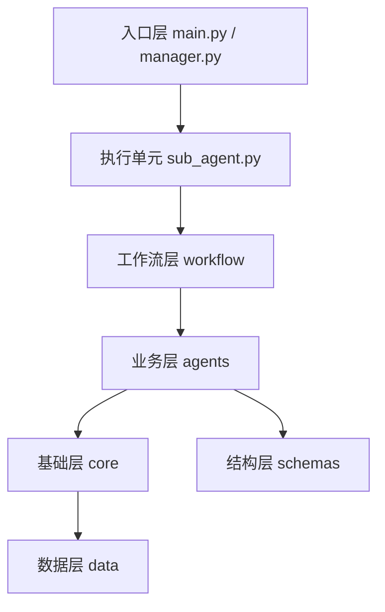
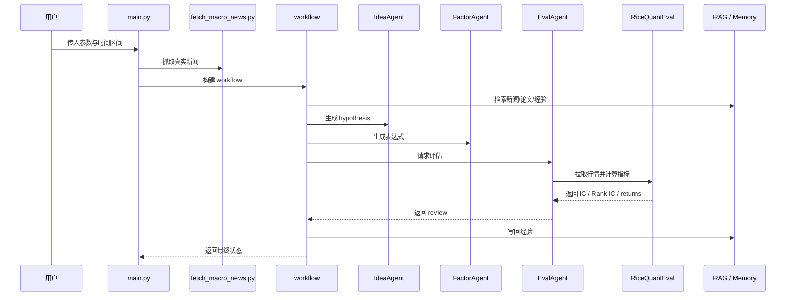

# AI Alpha Miner 详细说明

这份文档不是首页介绍，而是项目的详细说明版。  
它的目标是把这几个问题讲清楚：

1. 项目整体在做什么
2. 代码为什么这么分层
3. `main / manager / sub_agent / workflow / agents / core / schemas` 各自是什么关系
4. 数据从哪里来、怎么进 RAG、怎么进入评估
5. 运行一轮 workflow 时到底发生了什么

当前仓库状态以根目录代码为准，已经统一为 `RiceQuant-only` 版本。

---

## 1. 项目定位

AI Alpha Miner 是一个多智能体量化因子研究系统。

它不是只做一件事的“因子生成脚本”，而是把完整的研究过程拆成了多个阶段：

1. 先确定研究时间窗口
2. 拉取真实宏观/财经新闻
3. 从 RAG 里读取论文、市场元数据、经验记忆
4. 由 LLM 形成 hypothesis
5. 由 agent 把 hypothesis 转成表达式
6. 用真实市场数据做评估
7. 输出 review、指标和改进建议
8. 把这轮经验写回记忆库

因此，这个项目的重点不只是“生成一个 alpha”，而是让 alpha 研究变成一个可以重复执行、可以持续积累经验的研究闭环。

---

## 2. 顶层结构



### 分层解释

| 层级 | 文件/目录 | 负责什么 |
| --- | --- | --- |
| 入口层 | `main.py`、`manager.py` | 启动程序、解析参数、准备运行环境 |
| 执行层 | `sub_agent.py` | 把一条完整研究流程封装成子代理 |
| 编排层 | `workflow/` | 定义节点顺序、状态传递和循环规则 |
| 业务层 | `agents/` | 具体完成 hypothesis、表达式、评估、总结 |
| 基础层 | `core/` | 提供 LLM、RAG、RiceQuant 等公共能力 |
| 结构层 | `schemas/` | 限定 agent 输出结构 |
| 数据层 | `data/` | 文档、记忆库、测试数据、结果 |

---

## 3. 三个关键入口的关系

### 3.1 `main.py`

[`main.py`](/c:/Users/18709/Desktop/quantgit/main.py) 是单条工作流入口。

它负责：

1. 接收命令行参数
2. 解析市场时间区间
3. 在运行前抓取真实宏观新闻
4. 决定是否刷新 RAG
5. 构建 LangGraph workflow
6. 初始化 state
7. 运行整条链
8. 保存结果并打印摘要

所以它更像“单人模式”的入口。

### 3.2 `manager.py`

[`manager.py`](/c:/Users/18709/Desktop/quantgit/manager.py) 是 swarm 调度器。

它负责：

1. 接收多个角色设定
2. 初始化全局 RiceQuant 认证
3. 准备时间窗口和新闻数据
4. 为每个角色创建一个 `AlphaResearcher`
5. 串行或并行地运行多个 sub-agent
6. 对结果做阈值筛选
7. 做相关性去重
8. 进行 crossover 尝试
9. 输出报告，写 SQLite 和 JSON

所以它更像“经理”。

### 3.3 `sub_agent.py`

[`sub_agent.py`](/c:/Users/18709/Desktop/quantgit/sub_agent.py) 是 manager 手下的研究员执行器。

它负责：

- 接收一个角色 prompt
- 带着自己的时间窗口、模型配置和迭代参数
- 跑一遍完整 workflow
- 把结果整理成 manager 可汇总的结构

所以可以这样记：

- `main.py`：一个人直接跑
- `manager.py`：派多个人去跑
- `sub_agent.py`：每个人真正执行的那一条研究链

---

## 4. `workflow/` 为什么存在

很多人第一次看会觉得：`workflow` 是不是承担了一部分 `main` 的活？

答案是：**是的，但承担的是“流程编排”的活，而不是“程序入口”的活。**

### `main.py` 管什么

- 程序如何启动
- 参数怎么进来
- 初始状态怎么准备
- 最终结果怎么保存

### `workflow/` 管什么

- 节点顺序怎么排
- 失败后怎么结束
- 评估后是否继续下一轮
- 各节点之间共享哪些状态

如果没有 `workflow/`，这些逻辑往往会全部堆进 `main.py`，让入口文件变成一个很大的总控文件。  
现在把这部分拆出来之后，入口层和流程层就分开了。

---

## 5. `workflow/graph.py` 与 `workflow/state.py`

### 5.1 `workflow/graph.py`

[`workflow/graph.py`](/c:/Users/18709/Desktop/quantgit/workflow/graph.py) 定义的是 **流程图**。

从当前代码看，核心节点包括：

- `idea_agent`
- `factor_agent`
- `eval_agent`
- `increment`

路由规则大致是：

1. 先跑 `idea_agent`
2. 如果没有错误，进入 `factor_agent`
3. 再进入 `eval_agent`
4. 评估后根据 IC、patience、iteration 决定：
   - 结束
   - 还是进入 `increment` 再回到 `idea_agent`

所以它回答的问题是：

**“这条链怎么走？”**

### 5.2 `workflow/state.py`

[`workflow/state.py`](/c:/Users/18709/Desktop/quantgit/workflow/state.py) 定义的是 **这条链路共享什么状态**。

当前 state 中比较关键的字段有：

- 运行控制
  - `iteration`
  - `max_iterations`
  - `role_prompt`

- 上下文
  - `rag_context`
  - `market_regime_summary`
  - `macro_news_summary`

- hypothesis 阶段输出
  - `hypothesis_name`
  - `hypothesis_description`
  - `rationale`

- factor 阶段输出
  - `math_formula`
  - `variables_defined`
  - `code_expression`
  - `is_valid_syntax`

- eval 阶段输出
  - `backtest_metrics`
  - `daily_returns`
  - `review_summary`
  - `is_effective`
  - `suggested_improvements`

- 控制字段
  - `best_ic`
  - `patience_counter`
  - `error`
  - `messages`

所以它回答的问题是：

**“这条链路在传什么？”**

---

## 6. `agents/` 做什么

`agents/` 是业务执行层，回答的是：

**“每一步具体做什么？”**

### 6.1 `IdeaAgent`

文件：[`agents/idea_agent.py`](/c:/Users/18709/Desktop/quantgit/agents/idea_agent.py)

主要职责：

- 读取 RAG 检索结果
- 整合市场状态、新闻、论文和经验记忆
- 基于角色设定生成 hypothesis

它更像“研究员提出想法”的阶段。

### 6.2 `FactorAgent`

文件：[`agents/factor_agent.py`](/c:/Users/18709/Desktop/quantgit/agents/factor_agent.py)

主要职责：

- 把 hypothesis 形式化
- 定义变量
- 生成数学公式和代码表达式
- 做合法性与语法层面的基本检查

它更像“把研究想法落成可运行表达式”的阶段。

### 6.3 `EvalAgent`

文件：[`agents/eval_agent.py`](/c:/Users/18709/Desktop/quantgit/agents/eval_agent.py)

主要职责：

- 调用 `RiceQuantEval`
- 执行因子评估
- 生成 IC、Rank IC 等指标
- 输出 review 与改进建议

它更像“回测和批判性复核”的阶段。

### 6.4 `SummaryAgent`

文件：[`agents/summary_agent.py`](/c:/Users/18709/Desktop/quantgit/agents/summary_agent.py)

主要职责：

- 在 manager 阶段生成 markdown 报告
- 汇总最终因子池
- 负责偏展示和归档的收尾工作

---

## 7. `core/` 和 `agents/` 重不重复

不重复，而且这个分层是有必要的。

### `agents/`

负责“做什么”：

- 想 hypothesis
- 写表达式
- 做评估
- 写总结

### `core/`

负责“怎么做”：

- 调哪个模型
- 怎么检索 RAG
- 怎么调用 RiceQuant
- 怎么做公共底层能力封装

所以关系是：

- `agents` 调用 `core`
- `core` 为 `agents` 提供基础设施

### 7.1 `core/llm.py`

文件：[`core/llm.py`](/c:/Users/18709/Desktop/quantgit/core/llm.py)

负责：

- LLM 初始化
- provider / model 选择
- API key / base URL 等配置

### 7.2 `core/rag.py`

文件：[`core/rag.py`](/c:/Users/18709/Desktop/quantgit/core/rag.py)

负责：

- 读取 `data/rag_docs/`
- 切块、向量化、建库
- 从 Chroma 或经验库中检索上下文

### 7.3 `core/alphaeval/rq_eval.py`

文件：[`core/alphaeval/rq_eval.py`](/c:/Users/18709/Desktop/quantgit/core/alphaeval/rq_eval.py)

这是当前项目最关键的底层评估模块之一。

负责：

- RiceQuant 认证
- 行情获取
- 因子表达式执行
- IC / Rank IC 等指标计算
- dry-run / fallback 处理
- 市场状态总结

也就是说，现在“真实评估”基本都落在这个文件上。

---

## 8. `schemas/` 是做什么的

`schemas/` 当前主要是用来 **约束结构化输出** 的。

这也是你前面问过的那个点：  
**对，`schemas` 现在主要就是在管输出格式。**

### `schemas/messages.py`

文件：[`schemas/messages.py`](/c:/Users/18709/Desktop/quantgit/schemas/messages.py)

里面定义的是一些输出模型，例如：

- `HypothesisOutput`
- `FormalizationOutput`
- `ImplementationOutput`
- `ReflexiveReviewOutput`

它们的作用是：

- 让 agent 输出不是随便一段自然语言
- 而是具有固定字段的结构化结果
- 这样程序可以直接做校验和解析

### 和 `workflow/state.py` 的区别

这是最容易混的两个模块：

- [`workflow/state.py`](/c:/Users/18709/Desktop/quantgit/workflow/state.py)
  - 管流程里共享的状态
  - 强调“这条链当前携带哪些上下文”

- [`schemas/messages.py`](/c:/Users/18709/Desktop/quantgit/schemas/messages.py)
  - 管某一步输出的数据结构
  - 强调“这一步返回的数据必须长什么样”

一句话记：

- `state` 管传递
- `schemas` 管输出

---

## 9. `scripts/` 和 `tests/` 分别做什么

### 9.1 `scripts/`

`scripts/` 更像工具层，主要负责“抓取、整理、准备数据”。

当前主要包括：

- [`scripts/fetch_macro_news.py`](/c:/Users/18709/Desktop/quantgit/scripts/fetch_macro_news.py)
  - 抓取真实宏观/财经新闻
- [`scripts/fetch_market_metadata.py`](/c:/Users/18709/Desktop/quantgit/scripts/fetch_market_metadata.py)
  - 准备市场元数据文档
- [`scripts/fetch_academic_papers.py`](/c:/Users/18709/Desktop/quantgit/scripts/fetch_academic_papers.py)
  - 抓取/整理论文
- [`scripts/fetch_arxiv_qfin.py`](/c:/Users/18709/Desktop/quantgit/scripts/fetch_arxiv_qfin.py)
  - 面向 q-fin 的 arXiv 抓取
- [`scripts/fetch_arxiv_with_pkg.py`](/c:/Users/18709/Desktop/quantgit/scripts/fetch_arxiv_with_pkg.py)
  - 使用特定包抓 arXiv 的实现版本

所以 `scripts/` 本质上是在“往下摘取东西、整理东西、准备东西”。

### 9.2 `tests/`

`tests/` 是测试目录，负责“验证系统有没有坏”。

当前包括：

- [`tests/test_agent_validation.py`](/c:/Users/18709/Desktop/quantgit/tests/test_agent_validation.py)
  - 表达式合法性测试

- [`tests/test_operators.py`](/c:/Users/18709/Desktop/quantgit/tests/test_operators.py)
  - 底层算子与数值行为测试

- [`tests/test_rag.py`](/c:/Users/18709/Desktop/quantgit/tests/test_rag.py)
  - RAG 基础切块与检索测试

- [`tests/test_rq_connection.py`](/c:/Users/18709/Desktop/quantgit/tests/test_rq_connection.py)
  - RiceQuant 凭证与连接测试

所以一句话区分：

- `scripts/` = 帮项目干活
- `tests/` = 检查项目有没有坏

---

## 10. 数据来自哪里

### 10.1 市场数据

当前真实市场数据来自 RiceQuant。

入口位置：

- [`core/alphaeval/rq_eval.py`](/c:/Users/18709/Desktop/quantgit/core/alphaeval/rq_eval.py)

主要用途：

- 获取行情
- 计算因子
- 计算 IC / Rank IC
- 生成 market regime summary

### 10.2 财经/宏观新闻

当前真实新闻来自 Google News RSS。

入口位置：

- [`scripts/fetch_macro_news.py`](/c:/Users/18709/Desktop/quantgit/scripts/fetch_macro_news.py)

工作方式：

1. 根据关键词构造 RSS 查询
2. 带上时间区间
3. 抓取 RSS
4. 解析标题、来源、发布时间、摘要和链接
5. 写入 `data/rag_docs/macro_news/<year>/`

所以现在新闻部分已经不是模拟模板，而是真实抓取。

### 10.3 学术论文与长期知识

主要通过本地文档和抓取脚本进入：

- `academic/<year>/`
- `alphas/evergreen/`
- `market_meta/<year>/`

最终统一作为 RAG 文档供 agent 检索。

---

## 11. “实时拉取”准确是什么意思

项目里说的“实时拉取”，不是高频交易系统里的毫秒级实时流。

更准确地说，它表示：

- 程序启动后
- 按当前给定的市场区间
- 现场请求最新可用的真实数据

所以它更接近：

- on-demand fetch
- online fetch

而不是：

- 纯离线静态样本
- tick 级实时流

### 市场区间参数

由这些参数控制：

- `--market-start`
- `--market-end`
- `--market-lookback`

如果没有显式传开始时间，当前默认回看过去一年。

---

## 12. 数据目录结构

### 12.1 `data/rag_docs/`

这里是给 RAG 用的文档库。

结构大致如下：

```text
data/rag_docs/
├─ academic/<year>/
├─ macro_news/<year>/
├─ market_meta/<year>/
├─ alphas/evergreen/
└─ templates/
```

含义：

- `academic/<year>/`
  - 学术论文与研究摘要

- `macro_news/<year>/`
  - 真实新闻

- `market_meta/<year>/`
  - 市场背景和元数据

- `alphas/evergreen/`
  - 相对长期稳定的 alpha 知识库

- `templates/`
  - 文档模板

### 12.2 `data/chroma_db/`

这里是向量库与经验记忆存储区域。

当前经验记忆已经不是单一平铺文本，而是分层组织，包含：

- `recent`
- `summary`
- `archive`
- 明文 ledger

这意味着系统在下一轮 hypothesis 生成时，不是只看一坨杂乱历史，而是按层级优先读取更有价值的经验。

---

## 13. 一次运行到底发生了什么

下面用单次运行模式来描述整条链：



如果换成 `manager.py`，那么这条链会被多个 sub-agent 并行跑多次，最后由 manager 再做一轮筛选、相关性去重和 crossover。

---

## 14. 环境与配置

### 14.1 依赖

当前以 [`environment.yml`](/c:/Users/18709/Desktop/quantgit/environment.yml) 为主：

```bash
conda env create -f environment.yml
conda activate aiminer
```

### 14.2 `.env`

`.env` 里放真实配置，例如：

- LLM API key
- RiceQuant 用户名、密码或 token

### 14.3 `.env.example`

`.env.example` 只是模板，不应该放真实值。

### 14.4 `.gitignore`

`.gitignore` 用来告诉 Git：

- 哪些本地缓存不要提交
- 哪些日志不要提交
- 哪些密钥文件不要提交

---

## 15. 推荐阅读顺序

如果你要真正看懂这套代码，推荐顺序如下：

1. [`manager.py`](/c:/Users/18709/Desktop/quantgit/manager.py)
2. [`sub_agent.py`](/c:/Users/18709/Desktop/quantgit/sub_agent.py)
3. [`workflow/graph.py`](/c:/Users/18709/Desktop/quantgit/workflow/graph.py)
4. [`workflow/state.py`](/c:/Users/18709/Desktop/quantgit/workflow/state.py)
5. [`agents/idea_agent.py`](/c:/Users/18709/Desktop/quantgit/agents/idea_agent.py)
6. [`agents/factor_agent.py`](/c:/Users/18709/Desktop/quantgit/agents/factor_agent.py)
7. [`agents/eval_agent.py`](/c:/Users/18709/Desktop/quantgit/agents/eval_agent.py)
8. [`core/alphaeval/rq_eval.py`](/c:/Users/18709/Desktop/quantgit/core/alphaeval/rq_eval.py)
9. [`core/rag.py`](/c:/Users/18709/Desktop/quantgit/core/rag.py)
10. [`schemas/messages.py`](/c:/Users/18709/Desktop/quantgit/schemas/messages.py)
11. [`scripts/fetch_macro_news.py`](/c:/Users/18709/Desktop/quantgit/scripts/fetch_macro_news.py)

这个顺序的好处是：  
先建立入口和流程的心智图，再往下看 agent、评估和 RAG，不容易迷路。

---

## 16. 最后一句总结

如果要用一句话概括当前项目：

AI Alpha Miner 是一个以 `main / manager` 为入口、以 `workflow` 为流程编排、以 `agents` 为业务执行、以 `core` 为基础设施、以 `schemas` 约束结构化输出、并通过 RAG 和记忆库增强上下文、最终用 RiceQuant 做真实评估的多智能体因子研究系统。
